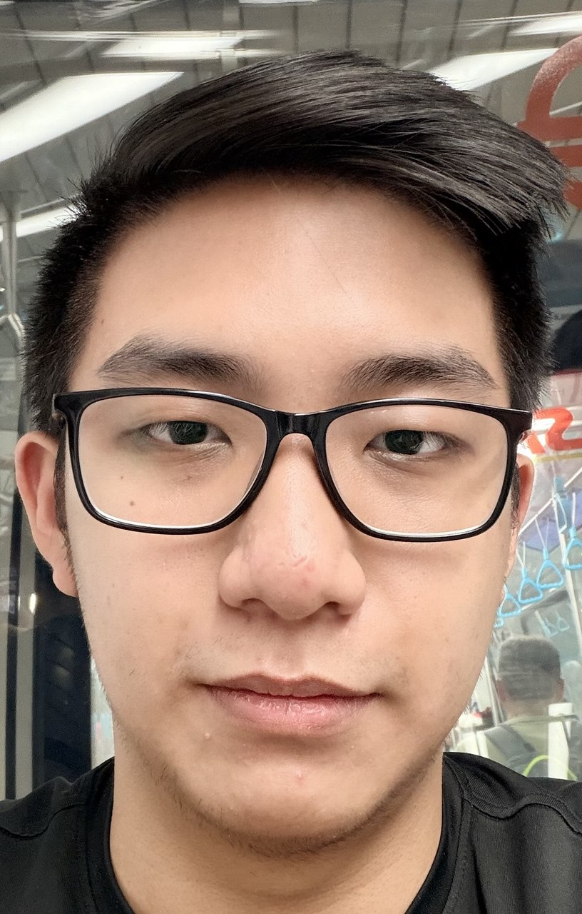
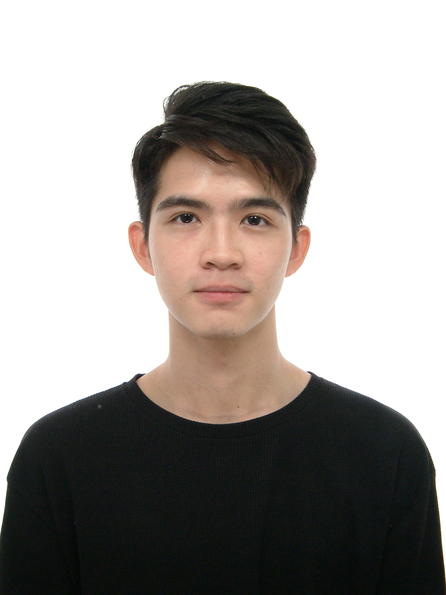

We are a team based in the [School of Computing, National University of Singapore](https://www.comp.nus.edu.sg).
This project is for [CS2013T (Software Engineering)](https://nus-cs2103-ay2526-s2.github.io).

## Project team

### Kai Zhe

[[github](https://github.com/cedarglass)]

* Role: Trusty Teammate
* Responsibilities: Expert for Logic and Model components

### Zhihan

[[github](http://github.com/johndoe)]
[[portfolio](team/johndoe.md)]

* Role: Team Lead
* Responsibilities: UI

### Hein Htet Zaw (Colin)

[[github](http://github.com/sr-71-black-bird)] 

* Role: Developer and Trusty Teammate
* Responsibilities: Data, Overview

### Jiaqi

[[github](http://github.com/nana-6381)]
[[portfolio](team/nana-6381.md)]

* Role: Teammate </3
* Responsibilities: Dev Ops + Threading

### Justin Lee

[[github](http://github.com/nitsujeel)]

* Role: Developer
* Responsibilities: UI
