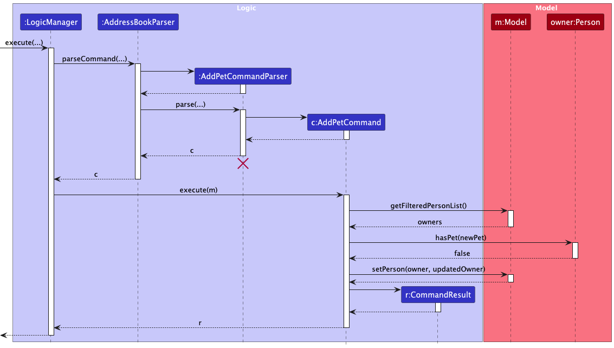

* Table of Contents
{:toc}

--------------------------------------------------------------------------------------------------------------------

<div style="page-break-after: always;"></div>

## **Acknowledgements**

* This project is based on the AddressBook-Level3 project created by the [SE-EDU initiative](https://se-education.org). We used that codebase as a starting point for PetLog.
* The session feature was inspired by NUS CS2103/T Project Duke's [Level 7](https://nus-cs2103-ay2526-s2.github.io/website/se-book-adapted/projectDuke/index.html#level-7-save) and [Level 8](https://nus-cs2103-ay2526-s2.github.io/website/se-book-adapted/projectDuke/index.html#level-8-dates-and-times). We used a similar approach when handling session date/time inputs.

--------------------------------------------------------------------------------------------------------------------

## **Setting up, getting started**

Refer to the guide [_Setting up and getting started_](SettingUp.md).

--------------------------------------------------------------------------------------------------------------------

<div style="page-break-after: always;"></div>

## **Design**

<div markdown="span" class="alert alert-primary">

:bulb: **Tip:** The `.puml` files used to create diagrams are in this document `docs/diagrams` folder. Refer to the [_PlantUML Tutorial_ at se-edu/guides](https://se-education.org/guides/tutorials/plantUml.html) to learn how to create and edit diagrams.
</div>

### Architecture


The ***Architecture Diagram*** given above explains the high-level design of the App.

Given below is a quick overview of main components and how they interact with each other.

**Main components of the architecture**

**`Main`** (consisting of classes [`Main`](https://github.com/AY2526S2-CS2103T-W14-1/tp/blob/master/src/main/java/seedu/address/Main.java) and [`MainApp`](https://github.com/AY2526S2-CS2103T-W14-1/tp/blob/master/src/main/java/seedu/address/MainApp.java)) is in charge of app launch and shutdown.
* At app launch, it initialises the other components in the correct sequence, and connects them up with each other.
* At shutdown, it shuts down the other components and invokes cleanup methods where necessary.

The bulk of the app's work is done by the following four components:

* [**`UI`**](#ui-component): The UI of the App.
* [**`Logic`**](#logic-component): The command executor.
* [**`Model`**](#model-component): Holds the data of the App in memory.
* [**`Storage`**](#storage-component): Reads data from, and writes data to, the hard disk.

[**`Commons`**](#common-classes) represents a collection of classes used by multiple other components.

**How the architecture components interact with each other**

The *Sequence Diagram* below shows how the components interact with each other for the scenario where the user issues the command `delete oi/1`.


Each of the four main components (also shown in the diagram above),

* defines its *API* in an `interface` with the same name as the Component.
* implements its functionality using a concrete `{Component Name}Manager` class, which follows the corresponding API `interface` mentioned in the previous point.

For example, the `Logic` component defines its API in the `Logic.java` interface and implements its functionality using the `LogicManager.java` class which follows the `Logic` interface. Other components interact with a given component through its interface rather than the concrete class (reason: to prevent outside components from being coupled to a component's implementation), as illustrated in the (partial) class diagram below.


The sections below give more details of each component.

<div style="page-break-after: always;"></div>

### UI component

The **API** of this component is specified in [`Ui.java`](https://github.com/AY2526S2-CS2103T-W14-1/tp/blob/master/src/main/java/seedu/address/ui/Ui.java)


The UI consists of a `MainWindow` that is made up of parts, e.g., `CommandBox`, `ResultDisplay`, `OwnerListPanel`, `SessionListPanel`, `ServiceListPanel`, `StatusBarFooter`, etc. All these, including the `MainWindow`, inherit from the abstract `UiPart` class which captures the commonalities between classes that represent parts of the visible GUI.

The `UI` component uses the JavaFX UI framework. The layouts of these UI parts are defined in matching `.fxml` files in the `src/main/resources/view` folder. For example, the layout of the [`MainWindow`](https://github.com/AY2526S2-CS2103T-W14-1/tp/blob/master/src/main/java/seedu/address/ui/MainWindow.java) is specified in [`MainWindow.fxml`](https://github.com/AY2526S2-CS2103T-W14-1/tp/blob/master/src/main/resources/view/MainWindow.fxml).

The `UI` component,

* executes user commands using the `Logic` component.
* listens for changes to `Model` data so that the UI can be updated with the modified data.
* keeps a reference to the `Logic` component, because the `UI` relies on the `Logic` to execute commands.
* depends on some classes in the `Model` component, as it displays `Person`, `Pet`, `Session`, and `Service` objects residing in the `Model`.

<div style="page-break-after: always;"></div>

### Logic component

**API** : [`Logic.java`](https://github.com/AY2526S2-CS2103T-W14-1/tp/blob/master/src/main/java/seedu/address/logic/Logic.java)

Here's a (partial) class diagram of the `Logic` component:


The sequence diagram below illustrates the interactions within the `Logic` component, taking `execute("delete oi/1")` API call as an example.


<div markdown="span" class="alert alert-info">:information_source: **Note:** The lifeline for `DeleteCommandParser` should end at the destroy marker (X) but due to a limitation of PlantUML, the lifeline continues till the end of diagram.
</div>

How the `Logic` component works:

1. When `Logic` is called upon to execute a command, it is passed to an `AddressBookParser` object which in turn creates a parser that matches the command (e.g., `DeleteCommandParser`) and uses it to parse the command.
1. This results in a `Command` object (more precisely, an object of one of its subclasses e.g., `DeleteCommand`) which is executed by the `LogicManager`.
1. The command can communicate with the `Model` when it is executed (e.g. to delete a person).<br>
   Note that although this is shown as a single step in the diagram above (for simplicity), in the code it can take several interactions (between the command object and the `Model`) to achieve.
1. The result of the command execution is encapsulated as a `CommandResult` object which is returned back from `Logic`.

Here are the other classes in `Logic` (omitted from the class diagram above) that are used for parsing a user command:


How the parsing works:
* When called upon to parse a user command, `AddressBookParser` creates an `XYZCommandParser` (`XYZ` is a placeholder for the specific command name, e.g., `AddOwnerCommandParser`). That parser uses the supporting classes shown above to parse input and create an `XYZCommand` object (e.g., `AddOwnerCommand`), which `AddressBookParser` returns as a `Command`.
* All `XYZCommandParser` classes (e.g., `AddOwnerCommandParser`, `DeleteCommandParser`, ...) inherit from the `Parser` interface so that they can be treated similarly where possible, e.g., during testing.

<div style="page-break-after: always;"></div>

### Model component

**API** : [`Model.java`](https://github.com/AY2526S2-CS2103T-W14-1/tp/blob/master/src/main/java/seedu/address/model/Model.java)


<div markdown="span" class="alert alert-info">:information_source: **Note:** Lower-level details such as owner and pet fields (e.g. `Address`, `Species`) have been omitted from the diagram.

</div>

The `Model` component,

* stores the PetLog data in an `AddressBook`, which contains all `Person` objects in a `UniquePersonList` and all `Service` objects in a `UniqueServiceList`.
* stores each owner's pets inside the corresponding `Person` object. Each `Pet` is made up of its own value objects such as `PetName`, `Species`, and `PetRemark`, and also owns its own list of `Session` objects.
* stores each `Session` as a time range with a fee and a list of associated `Service` objects, allowing one session to reference multiple services recorded in the `AddressBook`.
* stores the currently selected owners as a filtered list, exposed as an unmodifiable `ObservableList<Person>`. This allows the UI to observe owner list changes and update automatically.
* derives and stores a separate filtered pet list, exposed as an unmodifiable `ObservableList<Pet>`, so the UI can display pets in addition to the owner cards.
* derives and stores a displayed session list, exposed as an unmodifiable `ObservableList<SessionEntry>`. Each `SessionEntry` bundles a `Session` together with its owner and pet context for the UI.
* stores a `UserPrefs` object that represents the user’s preferences. This is exposed to the outside as a `ReadOnlyUserPrefs` object.
* does not depend on the `UI`, `Logic`, or `Storage` components, since the `Model` represents the domain entities and their relationships.

<div markdown="span" class="alert alert-info">:information_source: **Note:** An alternative (arguably, a more OOP) model is given below. It illustrates how `AddressBook` could store a shared `Tag` list that `Person` objects reference, instead of each `Person` storing its own `Tag` objects. This would reduce duplicate `Tag` instances across owners. For simplicity, the alternative diagram focuses only on the tag-related part of the model and omits the newer `Pet`, `Session`, and `Service` structures.<br>


</div>

<div style="page-break-after: always;"></div>

### Storage component

**API** : [`Storage.java`](https://github.com/AY2526S2-CS2103T-W14-1/tp/blob/master/src/main/java/seedu/address/storage/Storage.java)


The `Storage` component,
* exposes a unified `Storage` API that extends both `AddressBookStorage` and `UserPrefsStorage`.
* is implemented by `StorageManager`, which delegates to `JsonAddressBookStorage` (PetLog data) and `JsonUserPrefsStorage` (user preferences).
* persists `ReadOnlyAddressBook` as JSON through `JsonSerializableAddressBook`, which uses Jackson-friendly adapters (`JsonAdaptedPerson`, `JsonAdaptedPet`, `JsonAdaptedSession`, `JsonAdaptedService`, `JsonAdaptedTag`) to convert between JSON and model types.
* preserves nested domain data when reading/writing: owners include pets, pets include sessions, and sessions include services; the address book also stores a top-level service list.
* returns `Optional.empty()` when data files are missing, and throws `DataLoadingException` when file contents are malformed or violate model constraints.
* is invoked by `LogicManager` to save the address book after each successful command, while user preferences are loaded/saved during app startup and shutdown in `MainApp`.

### Common classes

Classes used by multiple components are in the `seedu.address.commons` package.

These include indexes, exceptions and utility classes.

--------------------------------------------------------------------------------------------------------------------

<div style="page-break-after: always;"></div>

## **Implementation**

This section describes some noteworthy details on how certain features are implemented.

### Pet management

The pet feature is implemented by extending each `Person` with a `LinkedHashSet<Pet>`.

Key implementation points:
* `AddPetCommand` targets an owner from the current filtered owner list using `oi/`.
* Pet identity is checked per owner via `Person#hasPet(Pet)`, which compares pet name + species after normalisation (case-insensitive, whitespace-normalised).
* On successful `addpet`, the command rebuilds that owner with an updated pet set and applies it through `Model#setPerson(...)`.
* Pet remarks are updated through `update oi/... pi/... pr/...` (`UpdatePetRemarkCommand`), which edits the selected pet and writes the owner back via `Model#setPerson(...)`.
* The model also maintains a derived filtered pet list (`Model#getFilteredPetList`) so the UI can render pets directly without recalculating from owners.

The sequence diagram below shows the main interaction flow for a successful `addpet` operation.


<div markdown="span" class="alert alert-info">:information_source: **Note:** The lifeline for `AddPetCommandParser` should end at the destroy marker (X) but due to a limitation of PlantUML, the lifeline continues till the end of diagram.
</div>

### Service catalogue

Services are stored as a top-level catalogue in `AddressBook` via `UniqueServiceList`.

Key implementation points:
* `addservice` validates service name/price through `ParserUtil` and `Service` constraints, then adds the service via `Model#addService(...)`.
* Service uniqueness is identity-based by normalised name (`Service#isSameService` / `Service#hasSameName`), so case/spacing variants are treated as duplicates.
* Price validation accepts only values from `0` to `10000` with up to 2 decimal places.
* `delete sn/...` removes a service by normalised name, and rejects mixed delete modes (e.g., owner index + service name in one command) at parser level.

### Session scheduling

Sessions are attached to pets (not stored as a top-level list), and each `Session` stores:
* a strict start time/end time (`yyyy-MM-dd HH:mm`)
* a computed total fee
* an immutable list of selected services

Key implementation points:
* `addsession` resolves owner (`oi/`) and pet (`pi/`) from the current filtered owner list.
* Date/time parsing is strict (`Session#parseDateTime`), and end time must be after start time.
* Optional repeated `sn/` prefixes are allowed to attach multiple services from the service catalogue.
* Total session fee is computed from the sum of selected service prices.
* Overlap prevention is enforced per pet via `Pet#hasOverlappingSession(...)`; sessions that only touch at boundaries are allowed.
* `delete oi/... pi/... si/...` removes a session by index within that pet’s session list.
* The UI-facing session list is a derived projection (`SessionEntry`) rebuilt by `Model#updateDisplayedSessions(...)`, so `list`, `find`, `addsession`, and relevant `delete` operations keep the session panel synchronised with the current owner filter.

Design note:
* Existing sessions keep their own service snapshots. Deleting a service from the catalogue affects future session creation, but not historical sessions already stored on pets.

<div style="page-break-after: always;"></div>

### \[Proposed\] Undo/redo feature

#### Proposed Implementation

The proposed undo/redo mechanism is facilitated by `VersionedAddressBook`. It extends `AddressBook` with an undo/redo history, stored internally as an `addressBookStateList` and `currentStatePointer`. Additionally, it implements the following operations:

* `VersionedAddressBook#commit()` — Saves the current PetLog state in its history.
* `VersionedAddressBook#undo()` — Restores the previous PetLog state from its history.
* `VersionedAddressBook#redo()` — Restores a previously undone PetLog state from its history.

These operations are exposed in the `Model` interface as `Model#commitAddressBook()`, `Model#undoAddressBook()` and `Model#redoAddressBook()` respectively.

Given below is an example usage scenario and how the undo/redo mechanism behaves at each step.

Step 1. The user launches the application for the first time. The `VersionedAddressBook` will be initialised with the initial PetLog state, and the `currentStatePointer` pointing to that single PetLog state.


Step 2. The user executes `delete oi/5` command to delete the 5th owner in PetLog. The `delete` command calls `Model#commitAddressBook()`, causing the modified state of PetLog after the `delete oi/5` command executes to be saved in the `addressBookStateList`, and the `currentStatePointer` is shifted to the newly inserted PetLog state.


Step 3. The user executes `addowner on/David …​` to add a new owner. The `addowner` command also calls `Model#commitAddressBook()`, causing another modified PetLog state to be saved into the `addressBookStateList`.


<div markdown="span" class="alert alert-info">:information_source: **Note:** If a command fails its execution, it will not call `Model#commitAddressBook()`, so the PetLog state will not be saved into the `addressBookStateList`.

</div>

Step 4. The user now decides that adding the owner was a mistake, and decides to undo that action by executing the `undo` command. The `undo` command will call `Model#undoAddressBook()`, which will shift the `currentStatePointer` once to the left, pointing it to the previous PetLog state, and restores PetLog to that state.


<div markdown="span" class="alert alert-info">:information_source: **Note:** If the `currentStatePointer` is at index 0, pointing to the initial AddressBook state, then there are no previous AddressBook states to restore. The `undo` command uses `Model#canUndoAddressBook()` to check if this is the case. If so, it will return an error to the user rather
than attempting to perform the undo.

</div>

The following sequence diagram shows how an undo operation goes through the `Logic` component:


<div markdown="span" class="alert alert-info">:information_source: **Note:** The lifeline for `UndoCommand` should end at the destroy marker (X) but due to a limitation of PlantUML, the lifeline reaches the end of diagram.

</div>

Similarly, how an undo operation goes through the `Model` component is shown below:


The `redo` command does the opposite — it calls `Model#redoAddressBook()`, which shifts the `currentStatePointer` once to the right, pointing to the previously undone state, and restores PetLog to that state.

<div markdown="span" class="alert alert-info">:information_source: **Note:** If the `currentStatePointer` is at index `addressBookStateList.size() - 1`, pointing to the latest PetLog state, then there are no undone PetLog states to restore. The `redo` command uses `Model#canRedoAddressBook()` to check if this is the case. If so, it will return an error to the user rather than attempting to perform the redo.

</div>

Step 5. The user then decides to execute the command `list`. Commands that do not modify the state of PetLog, such as `list`, will not call `Model#commitAddressBook()`, `Model#undoAddressBook()` or `Model#redoAddressBook()`. Thus, the `addressBookStateList` remains unchanged.


Step 6. The user executes `clear`, which calls `Model#commitAddressBook()`. Since the `currentStatePointer` is not pointing at the end of the `addressBookStateList`, all PetLog states after the `currentStatePointer` will be purged. Reason: It no longer makes sense to redo the `addowner on/David …​` command. This is the behaviour that most modern desktop applications follow.


The following activity diagram summarizes what happens when a user executes a new command:


#### Design considerations

**Aspect: How undo & redo executes:**

* **Alternative 1 (current choice):** Saves the entire state of PetLog.
  * Pros: Easy to implement.
  * Cons: May have performance issues in terms of memory usage.

* **Alternative 2:** Individual command knows how to undo/redo by
  itself.
  * Pros: Will use less memory (e.g. for `delete`, just save the person being deleted).
  * Cons: We must ensure that the implementation of each individual command are correct.

--------------------------------------------------------------------------------------------------------------------

## **Documentation, logging, testing, configuration, dev-ops**

* [Documentation guide](Documentation.md)
* [Testing guide](Testing.md)
* [Logging guide](Logging.md)
* [Configuration guide](Configuration.md)
* [DevOps guide](DevOps.md)

--------------------------------------------------------------------------------------------------------------------

<div style="page-break-after: always;"></div>

## **Appendix: Requirements**

### Product scope

**Target user profile**:

* is an independent pet day care and/or boarding service manager
* has to manage multiple owners, pets, service offerings, and care sessions daily
* prefers desktop apps over mobile/web apps for operational work
* can type fast and is comfortable with keyboard-driven workflows and prefixed command formats

**Value proposition**:

* manage owners, pets, services, and sessions faster than typical mouse-driven workflows
* schedule care sessions with optional services and automatically computed total fees
* keep all operational data in a local JSON file with automatic persistence and no internet dependency

<div style="page-break-after: always;"></div>

### User stories

Priorities: High (must have) - `* * *`, Medium (nice to have) - `* *`, Low (unlikely to have) - `*`

| Priority | As a …​              | I want to …​                                                                  | So that I can…​                                                                      |
|----------|----------------------|-------------------------------------------------------------------------------|--------------------------------------------------------------------------------------|
| `* * *`  | pet day care manager | add a new owner                                                               | record new clients and their contact details                                         |
| `* * *`  | pet day care manager | delete an owner                                                               | remove clients who no longer use my services                                         |
| `* * *`  | pet day care manager | view all owners                                                               | see an overview of my client base                                                    |
| `* * *`  | pet day care manager | add a new pet under an existing owner                                         | record the details of pets belonging to each owner                                   |
| `* * *`  | pet day care manager | delete a pet                                                                  | remove records of pets that no longer visit                                          |
| `* * *`  | pet day care manager | view all pets                                                                 | see all pets currently registered in the system                                      |
| `* * *`  | pet day care manager | view all pets belonging to a specific owner                                   | see all the pets of a client quickly during communication                            |
| `* * *`  | pet day care manager | add a new service                                                             | update my list of available services offered when new ones are introduced            |
| `* * *`  | pet day care manager | delete a service                                                              | update my list of available services offered when old ones are no longer offered     |
| `* * *`  | pet day care manager | view all services                                                             | see what services are in my most updated service catalogue at a glance               |
| `* * *`  | pet day care manager | add a session for an existing pet                                             | record appointment timings, services and fees of various pets                        |
| `* * *`  | pet day care manager | delete a session                                                              | remove past or cancelled appointments                                                |
| `* * *`  | pet day care manager | view all sessions                                                             | see what appointments are scheduled at a glance                                      |
| `* * *`  | pet day care manager | view records (owners, pets, services, sessions) in a compact, readable format | scan for information efficiently during busy hours                                   |
| `* *`    | pet day care manager | view usage instructions                                                       | refer to command formats quickly and conveniently when I forget them                 |
| `* *`    | pet day care manager | filter owners by name, phone, or email                                        | find owners by their details of the specific fields quickly                          |
| `* *`    | pet day care manager | filter pets by name, species, or remarks                                      | find a pet’s information quickly                                                     |
| `* *`    | pet day care manager | update an owner's contact details                                             | keep phone numbers and emails accurate and up-to-date for urgent communication       |
| `* *`    | pet day care manager | update a pet's details                                                        | keep critical details accurate and up-to-date in case of emergencies                 |
| `* *`    | pet day care manager | update a pet’s remarks                                                        | keep feeding instructions and special notes are accurate and up-to-date              |
| `* *`    | pet day care manager | update a service's price                                                      | keep the price of my services up to date without having to delete and re-add them    |
| `* *`    | pet day care manager | update a session's start/end time and services                                | keep the details of appointments up to date without having to delete and re-add them |
| `* *`    | pet day care manager | receive clear error messages for invalid commands                             | quickly correct mistakes without disrupting daily operations                         |
| `* *`    | pet day care manager | filter using partial keywords                                                 | search for specific records quickly even if I don’t remember exact spellings         |
| `*`      | pet day care manager | be warned before I delete an owner with existing pets                         | avoid accidentally losing linked pet and session records                             |
| `*`      | pet day care manager | be warned before I delete a pet with existing sessions                        | avoid accidentally losing linked session records                                     |
| `*`      | pet day care manager | sort owners and pets by name                                                  | organise entries easily when the list becomes large                                  |
| `*`      | pet day care manager | view an overview of owners, pets and sessions (e.g. count)                    | understand the scale of my operations at a glance                                    |
| `*`      | pet day care manager | view recently added or updated records                                        | get visual feedback for my most recent commands and track recent operational changes |

<div style="page-break-after: always;"></div>

### Use cases

(For all use cases below, the **System** is PetLog and the **Actor** is the user)

**Extensions for all use cases**

1. User requests PetLog to do something with provided inputs.

* 1a. PetLog detects that there are missing or invalid inputs (e.g. missing required prefixes, invalid index, inputs that are too long).
  * 1a1. PetLog informs the user of the missing or invalid inputs.

**Use case: UC01 - Add an owner**

MSS:

1. User requests to add an owner with the provided relevant details.
2. PetLog adds the owner into the owner list.
3. PetLog informs the user that the owner was added and shows the updated list of owners with the owner added.

    Use case ends.

Extensions:

* 1a. PetLog detects that the details match that of an existing owner.
  * 1a1. PetLog informs the user that the owner already exists.

    Use case ends.


* 1b. PetLog detects that the provided phone number contains non-numerical characters.
  * 1b1. PetLog notes this and gives a warning to the user in step 3 that the phone number contains non-numerical characters.

    Use case resumes from step 2.

**Use case: UC02 - Add a pet**

Precondition: The owner to which the pet is to be added already exists.

MSS:

1. User requests to add a pet with the provided relevant details to an owner.
2. PetLog adds the pet to the specified owner.
3. PetLog informs the user that the pet was added and shows the updated list of pets with the pet added.

    Use case ends.

Extensions:

* 1a. PetLog detects that the details match an existing pet of the same owner.
  * 1a1. PetLog informs the user that the pet already exists for that owner.

      Use case ends.

**Use case: UC03 - Update a pet's remarks**

Precondition: The pet whose details are to be updated already exists.

MSS:

1. User requests to overwrite the remarks of a pet with the provided updated remarks.
2. PetLog updates the remarks of the pet.
3. PetLog informs the user that the remarks have been updated and displays the updated pet with the new remarks.

    Use case ends.

**Use case: UC04 - Delete an owner**

Precondition: The owner to be deleted already exists.

MSS:

1. User requests to delete an owner.
2. PetLog deletes the owner.
3. PetLog informs the user that the deletion was successful and displays the new list of owners without the deleted owner.

    Use case ends.

**Use case: UC05 - Delete a pet**

Precondition: The pet to be deleted already exists.

MSS:

1. User requests to delete a pet.
2. PetLog deletes the pet.
3. PetLog informs the user that the deletion was successful and displays the new list of pets without the deleted pet.

    Use case ends.

**Use case: UC06 - Search for owners**

Precondition: Some owners already exist.

MSS:

1. User requests to search for owners by fields and keywords.
2. PetLog finds matching owners.
3. PetLog informs the user of the number of matching owners and displays them.

    Use case ends.

Extensions:

* 2a. PetLog does not find any owners with matching fields.
  * 2a1. PetLog informs the user that there are 0 matching owners.

    Use case ends.

**Use case: UC07 - List all records**

MSS:

1. User requests to list all records (owners, pets, services, sessions).
2. PetLog displays all records and informs the user it is showing all records.

    Use case ends.

**Use case: UC08 - Add a service**

MSS:

1. User requests to add a service with the provided name and price.
2. PetLog adds the service into the service list.
3. PetLog informs the user that the service was added and displays the updated service catalogue.

    Use case ends.

Extensions:

* 1b. PetLog detects that the provided name matches that of an existing service.
  * 1b1. PetLog informs the user that the service already exists.

    Use case ends.

**Use case: UC09 - Add a session with no services**

Precondition: The pet for which the session is to be added already exists.

MSS:

1. User requests to add a session to a specified pet, with the provided start and end times.
2. PetLog adds the session to the specified pet.
3. PetLog computes the total fee for the session.
4. PetLog informs the user that the session was added and displays the updated list of sessions with the session added.

    Use case ends.

Extensions:

* 1a. PetLog detects that the end time is not chronologically after the start time.
  * 1a1. PetLog informs the user that the end time of a session must be after its start time.

    Use case ends.


* 1b. PetLog detects that the session being added overlaps with an existing session for the specified pet.
  * 1b1. PetLog informs the user that the specified pet has an existing overlapping session.

    Use case ends.

**Use case: UC10 - Add a session with services**

Precondition: The pet for which the session is to be added already exists, and the services to be added to the session already exist.

MSS:

Same as UC09, but also with the specified services in step 1.


Extensions:

Same as UC09.

**Use case: UC11 - Delete a session**

Precondition: The session to be deleted exists.

MSS:

1. User requests to delete a specified session.
2. PetLog deletes the specified session.
3. PetLog informs the user that the deletion was successful and displays the new list of sessions without the deleted session.

    Use case ends.

**Use case: UC12 - Delete a service**

Precondition: The service to be deleted exists.

MSS:

1. User requests to delete a specified service.
2. PetLog deletes the specified service.
3. PetLog informs the user that the deletion was successful and displays the new list of services without the deleted service.

    Use case ends.

**Use case: UC13 - Editing an owner's details**

Precondition: The owner whose details are to be edited already exists.

MSS:

1. User requests to edit the provided fields of the specified owner.
2. PetLog overwrites the fields of the owner with the provided inputs.
3. PetLog informs the user that the edit was successful and displays the updated list of owners with the updated owner.

   Use case ends.

**Use case: UC14 - Clear all records**

MSS:

1. User requests to clear all records (owners, pets, services, sessions).
2. PetLog deletes all records.
3. PetLog informs the user that the deletion was successful and displays the updated blank lists.

   Use case ends.

**Use case: UC15 - Get help with commands**

MSS:

1. User requests for help with commands.
2. PetLog displays a list of all available commands and their formats, and provides the user with a link to the user guide.
3. PetLog informs the user that the help was provided successfully.

   Use case ends.

**Use case: UC16 - Searching for an owner to add a pet to / delete / edit / etc**

Precondition: The owner to be searched for already exists.

MSS:

1. User <u>searches for the specified owner (UC06)</u>.
2. User <u>adds a pet to the owner (UC02)</u> / <u>deletes the owner (UC04)</u> / <u>edits the owner (UC13)</u> / etc., using the updated owner index displayed in step 1.

    Use case ends.

**Use case: UC17 - Adjust the price of a service**

Precondition: The service whose price is to be adjusted already exists.

MSS:

1. User <u>deletes the service (UC12)</u>.
2. User <u>adds a service (UC08)</u> with the same name and adjusted price.

    Use case ends.

**Use case: UC18 - Change the timing / services of a session**

Precondition: The session to be changed already exists.

MSS:

1. User <u>deletes the session (UC11)</u>.
2. User <u>adds a session (UC09 or UC10)</u> with the changed timing / services.

    Use case ends.

**Use case: UC19 - Adjust the price of a service and recompute the fee of a session using that service**

Preconditions: The session and service already exist, the session uses the service.

MSS:

1. User <u>adjusts the price of the service (UC17)</u>.
2. User <u>deletes the session (UC11)</u>.
3. User <u>adds a session (UC10)</u> with the same name, time and services.

    Use case ends.

**Use case: UC20 - Close PetLog**

MSS:

1. User requests to close the application.
2. PetLog informs the user that the application will be closed.
3. PetLog closes the application.

    Use case ends.

<div style="page-break-after: always;"></div>

### Non-Functional Requirements

**Compatibility and Portability**
* PetLog should run as expected on Windows 11+, macOS 12+, Ubuntu 22.04 LTS+, as long as it has Java 17 or above installed.
* PetLog GUI should work well (i.e., should not cause any resolution-related inconveniences to the user) for standard screen resolutions 1920x1080 and higher, and for screen scales 100% and 125%.
* PetLog GUI should be usable (i.e., all functions can be used even if the user experience is not optimal) for resolutions 1280x720 and higher, and for screen scales 150%.
* PetLog should work without requiring an installer.

**Performance and Responsiveness**
* PetLog should start and show the main window within 1.0 s on initial launch on a baseline machine (8 GB RAM, SSD).
* Commands should complete and update UI within 500 ms for a maximal dataset size (up to 500 owners + 1000 pets + 50 services + 2000 sessions) on a baseline machine.
* Subsequent launches that open an existing data file of a maximal data set should complete and show the main window within 2.5 s on a baseline machine.

**Usability and Learnability**
* A user with typing speed above 50 words per minute for regular English text (i.e. not code, not system admin commands) should be able to accomplish their tasks faster using commands than they would using the mouse on a GUI application.
* Command error messages should be understandable to the user, by displaying the field/prefix at fault or the constraint violated.
* Success and error messages should be consistent to the user, by following a consistent template across commands.
* New users should be able to add an owner, add a pet, add a service and add a session in ≤ 5 minutes after reading the quickstart guide.

**Reliability and Data Integrity**
* When exiting PetLog via the `exit` command, 100% of data should persist across the app restarts.
* The data should be stored locally and should be in a human-editable text file.
* The data should not be stored in a database management system.
* On file load, invalid/corrupted data should be detected and reported to the user without PetLog crashing.
* PetLog should have a crash-free session rate of ≥ 99.9% in pre-release Quality Assurance runs.

**Network, Security and Privacy**
* PetLog should function fully offline and should not transmit data over any network.

**Maintainability**
* PetLog's codebase should utilise relevant Object-Oriented Programming paradigms whenever applicable.
* PetLog's codebase should abide by all the standards in the [CS2103/T Java coding standard](https://se-education.org/guides/conventions/java/intermediate.html).
* PetLog's codebase should be of high quality, with ≥ 95% of the lines of code not violating any of the guidelines in the [CS2103/T textbook](https://nus-cs2103-ay2526-s2.github.io/website/se-book-adapted/chapters/codeQuality.html). The violations should be justified by the author of the section of code with comments.

**Professionalism**
* PetLog should not use any vulgar/offensive language.

**Project Process**
* PetLog should be developed in a breadth-first incremental manner over the project duration.
* PetLog's codebase should only use third-party frameworks/libraries/services if they are free, open-source, and have permissive license terms, and do not require any installation by the user.
* PetLog should be packaged in a single JAR file.
* PetLog should abide by the following file sizes: ≤ 100 MB for JAR file, ≤ 15 MB / file for documents (e.g. PDF files).
* PetLog's DG and UG should be PDF-friendly.

<div style="page-break-after: always;"></div>

### Glossary

* **Prefix** - A short keyword followed by `/` used to identify a parameter in a command (e.g., `on/`, `ph/`).
* **Owner** - A pet owner who has entrusted their pet(s) to the boarding/day care service.
* **Tag** - A short label attached to an owner record for categorisation (e.g., regular, VIP).
* **Pet** - An animal registered under an owner in PetLog.
* **Species** - The type of animal (e.g., Cat, Dog, Guinea Pig).
* **Remarks** - Optional free-text notes attached to a pet or owner record (e.g., special care instructions, dietary needs).
* **Service** - A globally defined care item (e.g., shampoo, nail trim) with a price.
* **Service catalogue** - The full list of services stored in PetLog and reused by sessions.
* **Session** - A care booking/event attached to one pet, with start/end times and a computed total fee.
* **Fee** - The monetary total for a session, computed from selected services at session creation.
* **CLI** - Command Line Interface; a text-based interface where users interact by typing commands.
* **GUI** - Graphical User Interface; the visual interface displayed to the user.
* **Home folder** - The directory where the JAR runs and where PetLog stores `data/petlog.json`.

--------------------------------------------------------------------------------------------------------------------

<div style="page-break-after: always;"></div>

## **Appendix: Instructions for manual testing**

Given below are instructions to test the app manually.

<div markdown="span" class="alert alert-info">:information_source: **Note:** This appendix is intended as a guided starting point for manual exploratory testing.
It aims to complement the UG by suggesting a simple path for testing and providing test inputs that can be copy-pasted. It is not a comprehensive list of tests.
</div>

### Launch and shutdown

1. Initial launch

    1. Download the jar file and copy it into an empty folder.

    1. From your terminal, `cd` into the folder and run PetLog with `java -jar petlog.jar`. <br>
       Expected: GUI opens with sample data.

1. Help and window preference retention

    1. Test case: `help`<br>
       Expected: Help window appears.

    1. Resize the app window and move it to a different location. Close and relaunch the app.<br>
       Expected: Most recent window size and location are retained.

### Owner flow (`addowner`, `find`, `editowner`)

1. Positive tests: Add, search, and edit one owner

   1. Test inputs (copy-paste one by one):
      ```text
      addowner on/Manual Tester ph/81234567 em/manual.tester@example.com ad/123 Test Avenue, #01-02 ot/VIP
      find on/Manual Tester
      editowner oi/1 ph/87654321 at/premium rt/VIP
      find on/Manual Tester
      ```
      Expected: owner is added, filtered, edited, and still searchable.

1. Negative test

   1. Test case: `addowner on/Manual Tester ph/87654321 em/dup@example.com ad/1 Duplicate Road`<br>
      Expected: duplicate owner is rejected.

### Pet flow (`addpet`, `update`, `find`)

1. Positive tests: Add and update a pet

   1. Prerequisites: `find on/Manual Tester` shows this owner at `oi/1`.

   1. Test inputs:
      ```text
      addpet oi/1 pn/Pixel ps/Cat pr/Needs quiet handling
      update oi/1 pi/1 pr/Needs quiet handling and short breaks
      find pn/Pixel
      ```
      Expected: pet is added under the owner, remark updates, and owner is returned by pet search.

1. Negative tests

   1. Test case: `addpet oi/1 pn/Pixel ps/Cat`<br>
      Expected: duplicate pet for same owner is rejected.

   1. Test case: `update oi/1 pi/99 pr/invalid index check`<br>
      Expected: invalid pet index is rejected.

### Service and session flow (`addservice`, `addsession`)

1. Positive tests: Add services and create a session

   1. Prerequisites: `find on/Manual Tester` shows this owner at `oi/1` with `Pixel` at `pi/1`.

   1. Test inputs:
      ```text
      addservice sn/Test Grooming sp/25.00
      addservice sn/Test Nail Trim sp/12.50
      addsession oi/1 pi/1 st/2026-06-01 10:00 et/2026-06-01 11:30 sn/Test Grooming sn/Test Nail Trim
      ```
      Expected: services appear in service panel; session appears in session panel with computed fee.

1. Negative tests

   1. Test case: `addservice sn/Test Grooming sp/30.00`<br>
      Expected: duplicate service is rejected.

   1. Test case: `addsession oi/1 pi/1 st/2026-06-01 11:00 et/2026-06-01 12:00`<br>
      Expected: overlapping session is rejected.

   1. Test case: `addsession oi/1 pi/1 st/2026-06-01 13:00 et/2026-06-01 14:00 sn/No Such Service`<br>
      Expected: unknown service is rejected.

### Saving data

1. Positive test: Persistence across restart

    1. Prerequisites: run owner/pet/service/session flows first; do this check before deletion cleanup.

    1. Close and relaunch the app, then run `find on/Manual Tester`.<br>
       Expected: previously added records are still present.

### Deletion flow (`delete` owner/pet/session/service)

1. Positive tests: Delete all four supported targets

   1. Prerequisites: run previous sections first.

   1. Test inputs:
      ```text
      find on/Manual Tester
      delete sn/Test Grooming
      delete oi/1 pi/1 si/1
      delete oi/1 pi/1
      delete oi/1
      ```
      Expected: each delete mode succeeds (service, session, pet, owner).

1. Negative test:

   1. Test case: `delete oi/1 sn/Test Nail Trim`<br>
      Expected: invalid mixed delete format is rejected.

### Handling corrupted data

1. Robustness test: Missing/corrupted data file handling

   1. Close the app and open `data/petlog.json`.

   1. Introduce invalid JSON (e.g., remove one closing brace), save, and relaunch the app.<br>
      Expected: app does not crash; data may be reset to an empty state, and warning details are written to the log file.

--------------------------------------------------------------------------------------------------------------------

<div style="page-break-after: always;"></div>

## **Appendix: Effort**

This section explains the difficulty level, challenges faced, effort required, and achievements of PetLog's development.

Difficulty level of our project: medium.

Compared to AB3, which primarily manages a single core entity type, our project required more effort because it supports **multiple related entity types**, namely owners, pets, services, and sessions. This introduced additional complexity in both the codebase and the product design, as we had to **maintain clear relationships** between these entities while **keeping commands intuitive** for users.

The main challenges faced were in extending the original owner-centric data model to **support nested pet records and session tracking**, ensuring that **commands remained consistent** despite operating on **different entity types**, and keeping the UI and documentation aligned with the evolving feature set. Features such as service-linked sessions and indexed operations on pets and sessions also required more careful handling than the original AB3 workflow.

The team spent about 10 hours per week over 5 weeks, for a team of 5. This gives an estimated overall effort of about 250 person-hours.

Our key achievements were redesigning the model to **support richer domain relationships**, implementing features for managing pets, services, and care sessions, and producing a coherent user guide and developer guide that reflect the current architecture and feature set.

--------------------------------------------------------------------------------------------------------------------

<div style="page-break-after: always;"></div>

## **Appendix: Planned Enhancements**

This section will be updated with bugs we are aware of, and fixes that we propose to add in the near future.
