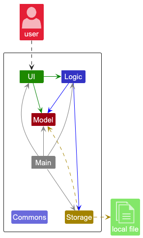
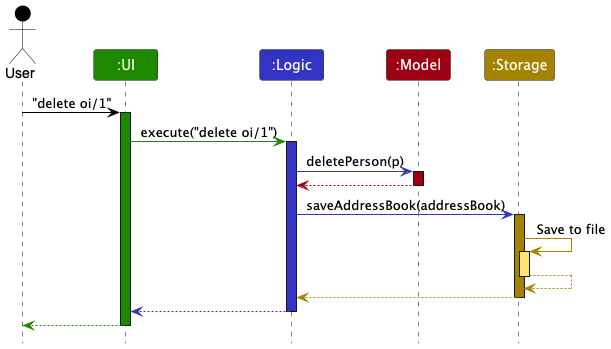
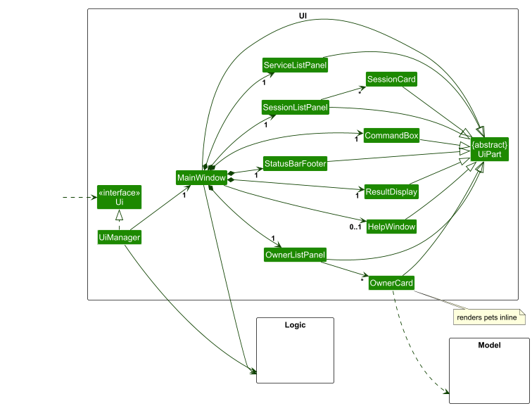
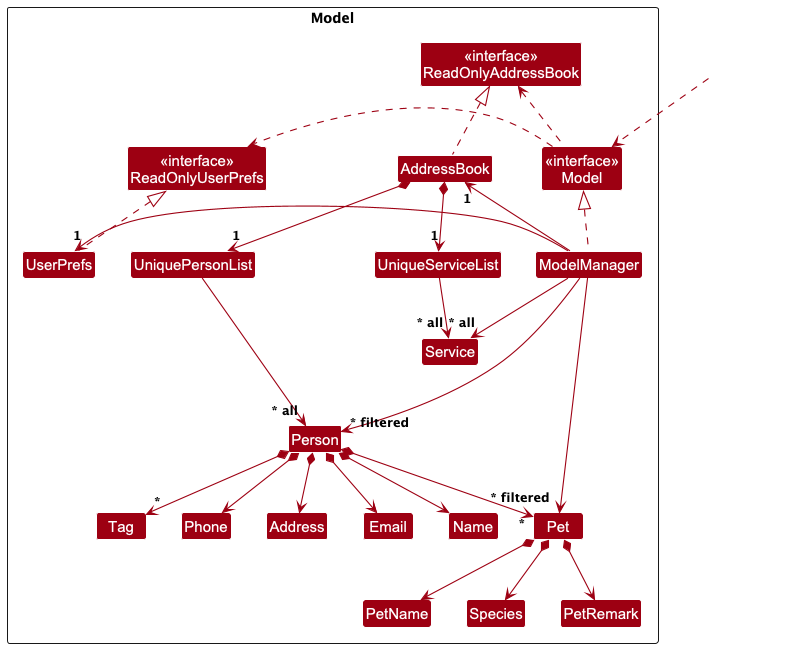

* Table of Contents
{:toc}

--------------------------------------------------------------------------------------------------------------------

## **Acknowledgements**

* This project is based on the AddressBook-Level3 project created by the [SE-EDU initiative](https://se-education.org). We used the codebase as a starting point for our implementation of Owners.
* The Sessions feature was inspired by NUS CS2103/T Project Duke's [Level 7](https://nus-cs2103-ay2526-s2.github.io/website/se-book-adapted/projectDuke/index.html#level-7-save) and [Level 8](https://nus-cs2103-ay2526-s2.github.io/website/se-book-adapted/projectDuke/index.html#level-8-dates-and-times). A similar implementation was used in understanding user inputs as dates and times for our Sessions.

--------------------------------------------------------------------------------------------------------------------

## **Setting up, getting started**

Refer to the guide [_Setting up and getting started_](SettingUp.md).

--------------------------------------------------------------------------------------------------------------------

## **Design**

:bulb: **Tip:** The `.puml` files used to create diagrams are in this document `docs/diagrams` folder. Refer to the [_PlantUML Tutorial_ at se-edu/guides](https://se-education.org/guides/tutorials/plantUml.html) to learn how to create and edit diagrams.

### Architecture

The ***Architecture Diagram*** given above explains the high-level design of the App.

Given below is a quick overview of main components and how they interact with each other.

**Main components of the architecture**

**`Main`** (consisting of classes [`Main`](https://github.com/se-edu/addressbook-level3/tree/master/src/main/java/seedu/address/Main.java) and [`MainApp`](https://github.com/se-edu/addressbook-level3/tree/master/src/main/java/seedu/address/MainApp.java)) is in charge of the app launch and shut down.
* At app launch, it initializes the other components in the correct sequence, and connects them up with each other.
* At shut down, it shuts down the other components and invokes cleanup methods where necessary.

The bulk of the app's work is done by the following four components:

* [**`UI`**](#ui-component): The UI of the App.
* [**`Logic`**](#logic-component): The command executor.
* [**`Model`**](#model-component): Holds the data of the App in memory.
* [**`Storage`**](#storage-component): Reads data from, and writes data to, the hard disk.

[**`Commons`**](#common-classes) represents a collection of classes used by multiple other components.

**How the architecture components interact with each other**

The *Sequence Diagram* below shows how the components interact with each other for the scenario where the user issues the command `delete oi/1`.

Each of the four main components (also shown in the diagram above),

* defines its *API* in an `interface` with the same name as the Component.
* implements its functionality using a concrete `{Component Name}Manager` class, which follows the corresponding API `interface` mentioned in the previous point.

For example, the `Logic` component defines its API in the `Logic.java` interface and implements its functionality using the `LogicManager.java` class which follows the `Logic` interface. Other components interact with a given component through its interface rather than the concrete class (reason: to prevent outside component's being coupled to the implementation of a component), as illustrated in the (partial) class diagram below.

The sections below give more details of each component.

### UI component

The **API** of this component is specified in [`Ui.java`](https://github.com/se-edu/addressbook-level3/tree/master/src/main/java/seedu/address/ui/Ui.java)

The UI consists of a `MainWindow` that is made up of parts e.g.`CommandBox`, `ResultDisplay`, `OwnerListPanel`, `PetListPanel`, `SessionListPanel`, `ServiceListPanel`, `StatusBarFooter` etc. All these, including the `MainWindow`, inherit from the abstract `UiPart` class which captures the commonalities between classes that represent parts of the visible GUI.

The `UI` component uses the JavaFx UI framework. The layout of these UI parts are defined in matching `.fxml` files that are in the `src/main/resources/view` folder. For example, the layout of the [`MainWindow`](https://github.com/se-edu/addressbook-level3/tree/master/src/main/java/seedu/address/ui/MainWindow.java) is specified in [`MainWindow.fxml`](https://github.com/se-edu/addressbook-level3/tree/master/src/main/resources/view/MainWindow.fxml)

The `UI` component,

* executes user commands using the `Logic` component.
* listens for changes to `Model` data so that the UI can be updated with the modified data.
* keeps a reference to the `Logic` component, because the `UI` relies on the `Logic` to execute commands.
* depends on some classes in the `Model` component, as it displays `Person`, `Pet`, `Session`, and `Service` objects residing in the `Model`.

### Logic component

**API** : [`Logic.java`](https://github.com/se-edu/addressbook-level3/tree/master/src/main/java/seedu/address/logic/Logic.java)

Here's a (partial) class diagram of the `Logic` component:

The sequence diagram below illustrates the interactions within the `Logic` component, taking `execute("delete oi/1")` API call as an example.

:information_source: **Note:** The lifeline for `DeleteCommandParser` should end at the destroy marker (X) but due to a limitation of PlantUML, the lifeline continues till the end of diagram.

How the `Logic` component works:

1. When `Logic` is called upon to execute a command, it is passed to an `AddressBookParser` object which in turn creates a parser that matches the command (e.g., `DeleteCommandParser`) and uses it to parse the command.
1. This results in a `Command` object (more precisely, an object of one of its subclasses e.g., `DeleteCommand`) which is executed by the `LogicManager`.
1. The command can communicate with the `Model` when it is executed (e.g. to delete a person). 
   Note that although this is shown as a single step in the diagram above (for simplicity), in the code it can take several interactions (between the command object and the `Model`) to achieve.
1. The result of the command execution is encapsulated as a `CommandResult` object which is returned back from `Logic`.

Here are the other classes in `Logic` (omitted from the class diagram above) that are used for parsing a user command:

How the parsing works:
* When called upon to parse a user command, the `AddressBookParser` class creates an `XYZCommandParser` (`XYZ` is a placeholder for the specific command name e.g., `AddOwnerCommandParser`) which uses the other classes shown above to parse the user command and create a `XYZCommand` object (e.g., `AddOwnerCommand`) which the `AddressBookParser` returns back as a `Command` object.
* All `XYZCommandParser` classes (e.g., `AddOwnerCommandParser`, `DeleteCommandParser`, ...) inherit from the `Parser` interface so that they can be treated similarly where possible e.g, during testing.

### Model component

**API** : [`Model.java`](https://github.com/se-edu/addressbook-level3/tree/master/src/main/java/seedu/address/model/Model.java)

The `Model` component,

* stores the PetLog data in an `AddressBook`, which contains all `Person` objects in a `UniquePersonList` and all `Service` objects in a `UniqueServiceList`.
* stores each owner's pets inside the corresponding `Person` object. Each `Pet` is made up of its own value objects such as `PetName`, `Species`, and `PetRemark`, and also owns its own list of `Session` objects.
* stores each `Session` as a time range with a fee and a list of associated `Service` objects, allowing one session to reference multiple services recorded in the `AddressBook`.
* stores the currently selected owners as a filtered list, exposed as an unmodifiable `ObservableList<Person>`. This allows the UI to observe owner list changes and update automatically.
* derives and stores a separate filtered pet list, exposed as an unmodifiable `ObservableList<Pet>`, so the UI can display pets in addition to the owner cards.
* derives and stores a displayed session list, exposed as an unmodifiable `ObservableList<SessionEntry>`. Each `SessionEntry` bundles a `Session` together with its owner and pet context for the UI.
* stores a `UserPrefs` object that represents the user’s preferences. This is exposed to the outside as a `ReadOnlyUserPrefs` object.
* does not depend on the `UI`, `Logic`, or `Storage` components, since the `Model` represents the domain entities and their relationships.

:information_source: **Note:** An alternative (arguably, a more OOP) model is given below. It illustrates how `AddressBook` could store a shared `Tag` list that `Person` objects reference, instead of each `Person` storing its own `Tag` objects. This would reduce duplicate `Tag` instances across owners. For simplicity, the alternative diagram focuses only on the tag-related part of the model and omits the newer `Pet`, `Session`, and `Service` structures. 

### Storage component

**API** : [`Storage.java`](https://github.com/se-edu/addressbook-level3/tree/master/src/main/java/seedu/address/storage/Storage.java)

The `Storage` component,
* exposes a unified `Storage` API that extends both `AddressBookStorage` and `UserPrefsStorage`.
* is implemented by `StorageManager`, which delegates to `JsonAddressBookStorage` (PetLog data) and `JsonUserPrefsStorage` (user preferences).
* persists `ReadOnlyAddressBook` as JSON through `JsonSerializableAddressBook`, which uses Jackson-friendly adapters (`JsonAdaptedPerson`, `JsonAdaptedPet`, `JsonAdaptedSession`, `JsonAdaptedService`, `JsonAdaptedTag`) to convert between JSON and model types.
* preserves nested domain data when reading/writing: owners include pets, pets include sessions, and sessions include services; the address book also stores a top-level service list.
* returns `Optional.empty()` when data files are missing, and throws `DataLoadingException` when file contents are malformed or violate model constraints.
* is invoked by `LogicManager` to save the address book after each successful command, while user preferences are loaded/saved during app startup and shutdown in `MainApp`.

### Common classes

Classes used by multiple components are in the `seedu.address.commons` package.

These include indexes, exceptions and utility classes.

--------------------------------------------------------------------------------------------------------------------

## **Implementation**

This section describes some noteworthy details on how certain features are implemented.

### Pet management

The pet feature is implemented by extending each `Person` with a `LinkedHashSet<Pet>`.

Key implementation points:
* `AddPetCommand` targets an owner from the current filtered owner list using `oi/`.
* Pet identity is checked per owner via `Person#hasPet(Pet)`, which compares pet name + species after normalisation (case-insensitive, whitespace-normalised).
* On successful `addpet`, the command rebuilds that owner with an updated pet set and applies it through `Model#setPerson(...)`.
* Pet remarks are updated through `update oi/... pi/... pr/...` (`UpdatePetRemarkCommand`), which edits the selected pet and writes the owner back via `Model#setPerson(...)`.
* The model also maintains a derived filtered pet list (`Model#getFilteredPetList`) so the UI can render pets directly without recalculating from owners.

### Service catalogue

Services are stored as a top-level catalog in `AddressBook` via `UniqueServiceList`.

Key implementation points:
* `addservice` validates service name/price through `ParserUtil` and `Service` constraints, then adds the service via `Model#addService(...)`.
* Service uniqueness is identity-based by normalised name (`Service#isSameService` / `Service#hasSameName`), so case/spacing variants are treated as duplicates.
* Price validation accepts only values from `0` to `10000` with up to 2 decimal places.
* `delete sn/...` removes a service by normalised name, and rejects mixed delete modes (e.g., owner index + service name in one command) at parser level.

### Session scheduling

Sessions are attached to pets (not stored as a top-level list), and each `Session` stores:
* a strict start time/end time (`yyyy-MM-dd HH:mm`)
* a computed total fee
* an immutable list of selected services

Key implementation points:
* `addsession` resolves owner (`oi/`) and pet (`pi/`) from the current filtered owner list.
* Date/time parsing is strict (`Session#parseDateTime`), and end time must be after start time.
* Optional repeated `sn/` prefixes are allowed to attach multiple services from the service catalogue.
* Total session fee is computed from the sum of selected service prices.
* Overlap prevention is enforced per pet via `Pet#hasOverlappingSession(...)`; sessions that only touch at boundaries are allowed.
* `delete oi/... pi/... si/...` removes a session by index within that pet’s session list.
* The UI-facing session list is a derived projection (`SessionEntry`) rebuilt by `Model#updateDisplayedSessions(...)`, so `list`, `find`, `addsession`, and relevant `delete` operations keep the session panel synchronised with the current owner filter.

Design note:
* Existing sessions keep their own service snapshots. Deleting a service from the catalogue affects future session creation, but not historical sessions already stored on pets.

### \[Proposed\] Undo/redo feature

#### Proposed Implementation

The proposed undo/redo mechanism is facilitated by `VersionedAddressBook`. It extends `AddressBook` with an undo/redo history, stored internally as an `addressBookStateList` and `currentStatePointer`. Additionally, it implements the following operations:

* `VersionedAddressBook#commit()` — Saves the current PetLog state in its history.
* `VersionedAddressBook#undo()` — Restores the previous PetLog state from its history.
* `VersionedAddressBook#redo()` — Restores a previously undone PetLog state from its history.

These operations are exposed in the `Model` interface as `Model#commitAddressBook()`, `Model#undoAddressBook()` and `Model#redoAddressBook()` respectively.

Given below is an example usage scenario and how the undo/redo mechanism behaves at each step.

Step 1. The user launches the application for the first time. The `VersionedAddressBook` will be initialised with the initial PetLog state, and the `currentStatePointer` pointing to that single PetLog state.

Step 2. The user executes `delete oi/5` command to delete the 5th owner in PetLog. The `delete` command calls `Model#commitAddressBook()`, causing the modified state of PetLog after the `delete oi/5` command executes to be saved in the `addressBookStateList`, and the `currentStatePointer` is shifted to the newly inserted PetLog state.

Step 3. The user executes `add on/David …​` to add a new owner. The `addowner` command also calls `Model#commitAddressBook()`, causing another modified PetLog state to be saved into the `addressBookStateList`.

:information_source: **Note:** If a command fails its execution, it will not call `Model#commitAddressBook()`, so the PetLog state will not be saved into the `addressBookStateList`.

Step 4. The user now decides that adding the person was a mistake, and decides to undo that action by executing the `undo` command. The `undo` command will call `Model#undoAddressBook()`, which will shift the `currentStatePointer` once to the left, pointing it to the previous PetLog state, and restores PetLog to that state.

:information_source: **Note:** If the `currentStatePointer` is at index 0, pointing to the initial AddressBook state, then there are no previous AddressBook states to restore. The `undo` command uses `Model#canUndoAddressBook()` to check if this is the case. If so, it will return an error to the user rather
than attempting to perform the undo.

The following sequence diagram shows how an undo operation goes through the `Logic` component:

:information_source: **Note:** The lifeline for `UndoCommand` should end at the destroy marker (X) but due to a limitation of PlantUML, the lifeline reaches the end of diagram.

Similarly, how an undo operation goes through the `Model` component is shown below:

The `redo` command does the opposite — it calls `Model#redoAddressBook()`, which shifts the `currentStatePointer` once to the right, pointing to the previously undone state, and restores PetLog to that state.

:information_source: **Note:** If the `currentStatePointer` is at index `addressBookStateList.size() - 1`, pointing to the latest PetLog state, then there are no undone PetLog states to restore. The `redo` command uses `Model#canRedoAddressBook()` to check if this is the case. If so, it will return an error to the user rather than attempting to perform the redo.

Step 5. The user then decides to execute the command `list`. Commands that do not modify the state of PetLog, such as `list`, will not call `Model#commitAddressBook()`, `Model#undoAddressBook()` or `Model#redoAddressBook()`. Thus, the `addressBookStateList` remains unchanged.

Step 6. The user executes `clear`, which calls `Model#commitAddressBook()`. Since the `currentStatePointer` is not pointing at the end of the `addressBookStateList`, all PetLog states after the `currentStatePointer` will be purged. Reason: It no longer makes sense to redo the `add on/David …​` command. This is the behaviour that most modern desktop applications follow.

The following activity diagram summarizes what happens when a user executes a new command:

#### Design considerations

**Aspect: How undo & redo executes:**

* **Alternative 1 (current choice):** Saves the entire state of PetLog.
  * Pros: Easy to implement.
  * Cons: May have performance issues in terms of memory usage.

* **Alternative 2:** Individual command knows how to undo/redo by
  itself.
  * Pros: Will use less memory (e.g. for `delete`, just save the person being deleted).
  * Cons: We must ensure that the implementation of each individual command are correct.

--------------------------------------------------------------------------------------------------------------------

## **Documentation, logging, testing, configuration, dev-ops**

* [Documentation guide](Documentation.md)
* [Testing guide](Testing.md)
* [Logging guide](Logging.md)
* [Configuration guide](Configuration.md)
* [DevOps guide](DevOps.md)

--------------------------------------------------------------------------------------------------------------------

## **Appendix: Requirements**

### Product scope

**Target user profile**:

* is an independent pet day care and/or boarding service manager
* has to manage multiple owners, pets, service offerings, and care sessions daily
* prefers desktop apps over mobile/web apps for operational work
* can type fast and is comfortable with keyboard-driven workflows and prefixed command formats

**Value proposition**: 

* manage owners, pets, services, and sessions faster than typical mouse-driven workflows
* schedule care sessions with optional services and automatically computed total fees
* keep all operational data in a local JSON file with automatic persistence and no internet dependency

### User stories

Priorities: High (must have) - `* * *`, Medium (nice to have) - `* *`, Low (unlikely to have) - `*`

| Priority | As a …​              | I want to …​                                                                  | So that I can…​                                                                      |
|----------|----------------------|-------------------------------------------------------------------------------|--------------------------------------------------------------------------------------|
| `* * *`  | pet day care manager | add a new owner                                                               | record new clients and their contact details                                         |
| `* * *`  | pet day care manager | delete an owner                                                               | remove clients who no longer use my services                                         |
| `* * *`  | pet day care manager | view all owners                                                               | see an overview of my client base                                                    |
| `* * *`  | pet day care manager | add a new pet under an existing owner                                         | record the detaills of pets belonging to each owner                                  |
| `* * *`  | pet day care manager | delete a pet                                                                  | remove records of pets that no longer visit                                          |
| `* * *`  | pet day care manager | view all pets                                                                 | see all pets currently registered in the system                                      |
| `* * *`  | pet day care manager | view all pets belonging to a specific owner                                   | see all the pets of a client quickly during communication                            |
| `* * *`  | pet day care manager | add a new service                                                             | update my list of available services offered when new ones are introduced            |
| `* * *`  | pet day care manager | delete a service                                                              | update my list of available services offered when old ones are no longer offered     |
| `* * *`  | pet day care manager | view all services                                                             | see what services are in my most updated service catalogue at a glance               |
| `* * *`  | pet day care manager | add a session for an existing pet                                             | record appointment timings, services and fees of various pets                        |
| `* * *`  | pet day care manager | delete a session                                                              | remove past or cancelled appointments                                                |
| `* * *`  | pet day care manager | view all sessions                                                             | see what appointments are scheduled at a glance                                      |
| `* * *`  | pet day care manager | view records (owners, pets, services, sessions) in a compact, readable format | scan for information efficiently during busy hours                                   |
| `* *`    | pet day care manager | view usage instructions                                                       | refer to command formats quickly and conveniently when I forget them                 |
| `* *`    | pet day care manager | filter owners by name, phone, or email                                        | find owners by their details of the specific fields quickly                          |
| `* *`    | pet day care manager | filter pets by name, species, or remarks                                      | find a pet’s information quickly                                                     |
| `* *`    | pet day care manager | update an owner's contact details                                             | keep phone numbers and emails accurate and up-to-date for urgent communication       |
| `* *`    | pet day care manager | update a pet's details                                                        | keep critical details accurate and up-to-date in case of emergencies                 |
| `* *`    | pet day care manager | update a pet’s remarks                                                        | keep feeding instructions and special notes are accurate and up-to-date              |
| `* *`    | pet day care manager | update a service's price                                                      | keep the price of my services up to date without having to delete and re-add them    |
| `* *`    | pet day care manager | update a sessions's start/end time and services                               | keep the details of appointments up to date without having to delete and re-add them |
| `* *`    | pet day care manager | receive clear error messages for invalid commands                             | quickly correct mistakes without disrupting daily operations                         |
| `* *`    | pet day care manager | filter using partial keywords                                                 | search for specific records quickly even if I don’t remember exact spellings         |
| `*`      | pet day care manager | be warned before I delete an owner with existing pets                         | avoid accidentally losing linked pet and session records                             |
| `*`      | pet day care manager | be warned before I delete a pet with existing sessions                        | avoid accidentally losing linked session records                                     |
| `*`      | pet day care manager | sort owners and pets by name                                                  | organise entries easily when the list becomes large                                  |
| `*`      | pet day care manager | view an overview of owners, pets and sessions (e.g. count)                    | understand the scale of my operations at a glance                                    |
| `*`      | pet day care manager | view recently added or updated records                                        | get visual feedback for my most recent commands and track recent operational changes |

### Use cases

(For all use cases below, the **System** is PetLog and the **Actor** is the user)

**Use case: Add Owner**

**MSS**

1. User adds an owner with the relevant details
2. PetLog adds the owner into the owner list
3. PetLog informs user that the owner was added
4. PetLog shows the updated list of owners

    Use case ends.

**Extensions**

* 1a. Missing owner details or invalid entries
  * 1a1. PetLog shows a relevant error message

    Use case ends.

* 1b. Duplicate owner
  * 1b1. PetLog shows a relevant error message

    Use case ends.
	       
**Use case: Add Pet**

**Preconditions: The owner exists**

**MSS**

1. User adds a pet to an existing owner
2. PetLog adds pet to the specified owner
3. PetLog informs user that the pet was added
4. PetLog shows the updated list of owners with the pet added

    Use case ends.

**Extensions**

* 1a. Missing owner index, invalid owner index, malformed command, or invalid pet details
  * 1a1. PetLog shows a relevant error message

    Use case ends.

* 1b. Duplicate pet
  * 1b1. PetLog shows a relevant error message

    Use case ends.
	  
**Use case: Update Pet Remarks**

**Preconditions: Owner exists and pet exists under that owner**

**MSS**

1. User updates the remarks of an existing pet
2. PetLog updates the remarks
3. PetLog informs user that the remark has been updated
4. PetLog displays the updated list with the new remark

    Use case ends.

**Extensions**

* 1a. Missing or invalid indices, unrecognized prefixes, malformed command, repeated prefix
  * 1a1. PetLog shows a relevant error message

    Use case ends.

**Use case: Delete Owner**

**MSS**

1. User requests to delete the owner
2. PetLog deletes the owner
3. PetLog informs user about the successful deletion
4. PetLog displays new list without the deleted owner

    Use case ends.

**Extensions**

* 1a. Missing, invalid, out-of-range index, malformed command, unrecognized prefixes
  * 1a1. PetLog shows a relevant error message

    Use case ends.

**Use case: Delete Pet**

**Preconditions: Owner exists and pet exists under that owner**

**MSS**

1. User requests to delete the pet
2. PetLog deletes the pet
3. PetLog informs user about the successful deletion
4. PetLog displays new list without the deleted pet

    Use case ends.

**Extensions**

* 1a. Missing, invalid, out-of-range index, malformed command, unrecognized prefixes
  * 1a1. PetLog shows a relevant error message

    Use case ends.

**Use case: Find Owner**

**MSS**

1. User searches for owners by keywords
2. PetLog finds matching owners
3. PetLog displays a list of matching owners
4. PetLog informs user of the number of matching owners

    Use case ends.

**Extensions**

* 1a. No prefixes, unrecognized prefixes, malformed command
    * 1a1. PetLog shows a relevant error message

      Use case ends.

	  
* 1b. Invalid field contents entered in search
  * 1b1. PetLog displays that there are 0 matches

    Use case ends.

**Use case: List**

**MSS**

1. User requests to list all records of owners and pets
2. PetLog displays the list of owners and pets
3. PetLog confirms it is showing all records

    Use case ends.

**Extensions**

* 1a. Misspelled command, unnecessary prefix inputs
  * 1a1. PetLog displays a relevant error message

    Use case ends.

**Use case: Add Service**

**MSS**

1. User adds a service with the service name and price
2. PetLog adds the service into the service list
3. PetLog informs user that the service was added
4. PetLog displays the updated service list

    Use case ends.

**Extensions**

* 1a. Missing service details or invalid entries
  * 1a1. PetLog shows a relevant error message

    Use case ends.

* 1b. Duplicate service
  * 1b1. PetLog shows a relevant error message

    Use case ends.

**Use case: Add Session**

**Preconditions: Owner exists and pet exists under that owner**

**MSS**

1. User adds a session to a specified pet under a specified owner
2. PetLog validates the owner, pet, time range, and optional services
3. PetLog adds the session to the specified pet
4. PetLog computes the total fee for the session
5. PetLog informs user that the session was added
6. PetLog displays the updated session list

    Use case ends.

**Extensions**

* 1a. Missing indices, invalid indices, malformed command, or invalid date-time format
  * 1a1. PetLog shows a relevant error message

    Use case ends.

* 2a. One or more specified services do not exist
  * 2a1. PetLog shows a relevant error message

    Use case ends.

* 2b. End time is not after start time
  * 2b1. PetLog shows a relevant error message

    Use case ends.

* 2c. Session overlaps with an existing session for the selected pet
  * 2c1. PetLog shows a relevant error message

    Use case ends.

**Use case: Delete Session**

**Preconditions: Owner exists, pet exists under that owner, and the pet has at least one session**

**MSS**

1. User requests to delete a session from a specified pet under a specified owner
2. PetLog deletes the specified session
3. PetLog informs user about the successful deletion
4. PetLog displays the updated session list

    Use case ends.

**Extensions**

* 1a. Missing indices, invalid indices, out-of-range indices, or malformed command
  * 1a1. PetLog shows a relevant error message

    Use case ends.

**Use case: Delete Service**

**Preconditions: Service exists**

**MSS**

1. User requests to delete a service by service name
2. PetLog finds the matching service
3. PetLog deletes the service
4. PetLog informs user about the successful deletion
5. PetLog displays the updated service list

    Use case ends.

**Extensions**

* 1a. Missing service name, malformed command, or unrecognized prefixes
  * 1a1. PetLog shows a relevant error message

    Use case ends.

* 2a. Service name does not match any existing service
  * 2a1. PetLog shows a relevant error message

    Use case ends.

### Non-Functional Requirements

**Compatibility and Portability**
* PetLog should run as expected on Windows 11+, macOS 12+, Ubuntu 22.04 LTS+, as long as it has Java 17 or above installed.
* PetLog GUI should work well (i.e., should not cause any resolution-related inconveniences to the user) for standard screen resolutions 1920x1080 and higher, and for screen scales 100% and 125%.
* PetLog GUI should be usable (i.e., all functions can be used even if the user experience is not optimal) for resolutions 1280x720 and higher, and for screen scales 150%.
* PetLog should work without requiring an installer.

**Performance and Responsiveness**
* PetLog should start and show the main window within 2.5 s on a baseline machine (8 GB RAM, SSD).
* Commands should complete and update UI within 500 ms for a dataset size of up to 1000 owners + 5000 pets.
* Opening an existing data file of up to 1000 owners + 2000 pets + 50 services + 2000 sessions should complete within 5.0 s.

**Usability and Learnability**
* A user with typing speed above 50 words per minute for regular English text (i.e. not code, not system admin commands) should be able to accomplish their tasks faster using commands than using the mouse.
* Command error messages should be understandable to the user, by displaying the field/prefix at fault or the constraint violated.
* Success and error messages should be consistent to the user, by following a consistent template across commands.
* New users should be able to add an owner, add a pet, add a service and add a session in <= 10 minutes after reading the quickstart guide.

**Reliability and Data Integrity**
* When exiting PetLog via the exit command, 100% of data should persist across the app restarts.
* The data should be stored locally and should be in a human editable text file.
* The data should not be stored in a database management system.
* On file load, invalid/corrupted data should be detected and reported to the user without PetLog crashing.
* PetLog should have a crash-free session rate of ≥ 99.5% in pre-release Quality Assurance runs.

**Network, Security and Privacy**
* PetLog should function fully offline and should not transmit data over any network.

**Maintainability**
* PetLog's codebase should utilise relevant Object-Oriented Programming paradigms whenever applicable.
* PetLog's codebase should abide by all the standards in the CS2103/T Java coding standard.
* PetLog's codebase should be of high quality, with >= 95% of the lines of code not violating any of the guidelines in the CS2103/T textbook (under Implementation → Code quality). The violations should be justifiable by the author of the section of code.

**Professionalism**
* PetLog should not use any vulgar/offensive language.

**Project Process**
* Petlog should be developed in a breadth-first incremental manner over the project duration.
* PetLog's implementation is expected to adhere to a schedule that dynamically shifts and is agreed upon by the majority of members.
* PetLog's codebase should only use third-party frameworks/libraries/services if they are free, open-source, and have permissive license terms, and do not require any installation by the user.
* PetLog should be packaged in a single JAR file.
* PetLog should abide by the following file sizes: <= 100 MB for JAR file, <= 15 MB / file for documents (e.g. PDF files).
* PetLog's DG and UG should be PDF-friendly.

### Glossary

* **Owner** - A pet owner who has entrusted their pet(s) to the boarding/day care service.
* **Pet** - An animal registered under an owner in PetLog.
* **Species** - The type of animal (e.g., Cat, Dog, Guinea Pig).
* **Remarks** - Optional free-text notes attached to a pet or owner record (e.g., special care instructions, dietary needs).
* **Owner index (`oi/`)** - A 1-based index into the currently displayed owner list.
* **Pet index (`pi/`)** - A 1-based index into the selected owner's pet list.
* **Service** - A globally defined care item (e.g., shampoo, nail trim) with a price from 0 to 10000 (inclusive),
  up to 2 decimal places, using only digits and `.`.
* **Service catalogue** - The full list of services stored in PetLog and reused by sessions.
* **Session** - A care booking/event attached to one pet, with start/end times and a computed total fee.
* **Fee** - The monetary total for a session, computed from selected services at session creation.
* **CLI** - Command Line Interface; a text-based interface where users interact by typing commands.
* **GUI** - Graphical User Interface; the visual interface displayed to the user.
* **Mainstream OS** - Windows, Linux, Unix, MacOS.
* **Care Session** - A period during which a pet is checked in to the boarding/day care service.
* **Tag** - A short label attached to an owner record for categorisation (e.g., regular, VIP).
* **Prefix** - A short keyword followed by `/` used to identify a parameter in a command (e.g., `n/`, `ph/`).
* **Home folder** - The directory where the JAR runs and where PetLog stores `data/petlog.json`.

--------------------------------------------------------------------------------------------------------------------

## **Appendix: Instructions for manual testing**

Given below are instructions to test the app manually.

:information_source: **Note:** These instructions only provide a starting point for testers to work on;
testers are expected to do more *exploratory* testing.

### Launch and shutdown

1. Initial launch

   1. Download the jar file and copy into an empty folder

   1. Double-click the jar file.  
      Expected: Shows the GUI with a set of sample contacts. The window size may not be optimum.

1. Saving window preferences

   1. Resize the window to an optimum size. Move the window to a different location. Close the window.

   1. Re-launch the app by double-clicking the jar file. 
      Expected: The most recent window size and location is retained.

### Adding an owner

1. Adding an owner

   1. Prerequisites: App is launched with sample data (contains owner `Alex Yeoh`).

   1. Test case: `addowner on/Jane Tan ph/81234567 em/jane.tan@gmail.com ad/12 Tampines Street 11, #03-55 ot/vip` 
      Expected: A new owner is added and shown in the owner list.

   1. Test case: `addowner on/Jane_#VIP! ph/81234568 em/jane.vip@gmail.com ad/13 Tampines Street 12, #03-56` 
      Expected: A new owner is added and shown in the owner list.

   1. Test case: `addowner on/Jane Tan ph/8123-4567 em/jane.alt@gmail.com ad/14 Tampines Street 13, #03-57` 
      Expected: A new owner is added and a warning is shown because the phone contains non-numeric characters.

   1. Test case: `addowner on/Jane Tan ph/81234567 em/jane.special@gmail.com ad/Unit #05-01 @ Pet-Hub / Block A` 
      Expected: A new owner is added and shown in the owner list.

   1. Test case: `addowner on/Jane Tan ph/81234567 em/jane.tags@gmail.com ad/15 Tampines Street 14, #03-58 ot/#VIP-Prime!` 
      Expected: A new owner is added and shown in the owner list.

   1. Test case: `addowner on/Alex Yeoh ph/99998888 em/alex.new@example.com ad/1 New Address` 
      Expected: Command fails with `Owner already exists.`

   1. Test case: `addowner on/Jane Tan ph/81234567 em/jane.tan@gmail.com` 
      Expected: Command fails due to invalid format (missing required `ad/` prefix).

   1. Test case: `addowner on/AAAAAAAAAAAAAAAAAAAAAAAAAAAAAAAAAAAAAAAAAAAAAAAAAAA ph/81234567 em/jane.tan@gmail.com ad/12 Tampines Street 11, #03-55` 
      Expected: Command fails with owner name validation error (owner name must be 1 to 50 characters).

   1. Test case: `addowner on/Jane Tan ph/1 em/jane.tan@gmail.com ad/12 Tampines Street 11, #03-55` 
      Expected: Command fails with phone validation error (phone number must be 2 to 30 characters).

   1. Test case: `addowner on/Jane Tan ph/81234567 em/jane.tan@gmail.com ad/AAAAAAAAAAAAAAAAAAAAAAAAAAAAAAAAAAAAAAAAAAAAAAAAAAAAAAAAAAAAAAAAAAAAAAAAAAAAAAAAAAAAAAAAAAAAAAAAAAAAA` 
      Expected: Command fails with address validation error (address must be 1 to 100 characters).

   1. Test case: `addowner on/Jane Tan ph/81234567 em/jane.tan@gmail.com ad/12 Tampines Street 11, #03-55 ot/AAAAAAAAAAAAAAAAAAAAA` 
      Expected: Command fails with tag validation error (tag must be 1 to 20 characters).

### Adding a pet

1. Adding a pet to an existing owner

   1. Prerequisites: App is launched with sample data (contains owner `Alex Yeoh` at owner index 1).

   1. Test case: `addpet oi/1 pn/Milo ps/Cat pr/Needs medication after meals` 
      Expected: A new pet named `Milo` is added under `Alex Yeoh` and shown in the pet list for that owner.

   1. Test case: `addpet oi/1 pn/@Milo! ps/Cat` 
      Expected: Command succeeds. A new pet named `@Milo!` is added under `Alex Yeoh`.

   1. Test case: `addpet oi/1 pn/Milo ps/D0g-@Home` 
      Expected: Command succeeds. A new pet with species `D0g-@Home` is added under `Alex Yeoh`.

   1. Test case: `addpet oi/1 pn/Buddy ps/Dog pr/Very energetic` 
      Expected: Command fails with `This person already has this pet.`

   1. Test case: `addpet oi/999 pn/Milo ps/Cat pr/Friendly` 
      Expected: Command fails because the owner index is invalid.

   1. Test case: `addpet oi/1 pn/AAAAAAAAAAAAAAAAAAAAAAAAAAAAAAA ps/Cat` 
      Expected: Command fails with pet name validation error (`Pet name must be 1 to 30 characters.`).

   1. Test case: `addpet oi/1 pn/Milo ps/AAAAAAAAAAAAAAAAAAAAAAAAAAAAAAA` 
      Expected: Command fails with species validation error (`Species must be 1 to 30 characters.`).

   1. Test case: `addpet oi/1 pn/Milo ps/Cat pr/AAAAAAAAAAAAAAAAAAAAAAAAAAAAAAAAAAAAAAAAAAAAAAAAAAAAAAAAAAAAAAAAAAAAAAAAAAAAAAAAAAAAAAAAAAAAAAAAAAAAA` 
      Expected: Command fails with remark validation error (`Remarks for addpet must be 1 to 100 characters.`).

   1. Test case: `addpet oi/1 pn/Milo ps/Cat pr/` 
      Expected: Command fails with remark validation error (`Remarks for addpet must be 1 to 100 characters.`).

   1. Test case: `addpet oi/1 pn/Milo pr/Friendly` 
      Expected: Command fails due to invalid format (missing required `ps/` prefix).

### Editing an owner

1. Editing the fields of an existing owner

   1. Prerequisites: Use sample data (contains owner `Alex Yeoh` at index 1).

   1. Test case: `editowner oi/1 em/yeohalex@example.com`  
      Expected: `Alex Yeoh`'s email updates to `yeohalex@example.com`.

   1. Test case: `editowner oi/1 rt/friend at/enemy`  
      Expected: `Alex Yeoh`'s `friend` tag is removed, and a `enemy` tag is added.

   1. Test case: `editowner oi/1 at/#VIP-Prime!`  
      Expected: `Alex Yeoh` receives a new tag `#VIP-Prime!`.

   1. Test case: `editowner oi/1 at/AAAAAAAAAAAAAAAAAAAAA`  
      Expected: Command fails with tag validation error (tag must be 1 to 20 characters).

   1. Test case: `editowner oi/1 ot/`  
      Expected: `Alex Yeoh`'s existing tags are removed.

### Finding an owner

1. Finding owners using owner fields

   1. Prerequisites: Use sample data (contains owner `Alex Yeoh`).

   1. Test case: `find on/alex` 
      Expected: Owner list shows matching owners whose names contain `alex` (case-insensitive), including `Alex Yeoh`.

   1. Test case: `find ad/ang mo kio` 
      Expected: Owner list shows only owners whose address contains `ang mo kio`.

   1. Test case: `find on/nonexistentowner` 
      Expected: Owner list shows 0 results and status message indicates `Listed 0 owner(s).`

### Finding a specific pet

1. Finding owners that have a pet matching given pet fields

   1. Prerequisites: Use sample data (contains pet `Buddy`, species `Dog`, under `Alex Yeoh`).

   1. Test case: `find pn/buddy` 
      Expected: Owner list shows owners with at least one pet whose name contains `buddy`.

   1. Test case: `find pn/buddy ps/dog` 
      Expected: Owner list shows owners with at least one pet matching pet name or species criteria.

   1. Test case: `find on/alex pn/buddy` 
      Expected: Owner list shows owners matching owner name or pet name criteria.

### Adding a service

1. Adding a service to the service list

   1. Prerequisites: Service `Ear cleaning` does not already exist.

   1. Test case: `addservice sn/Ear cleaning sp/12.50` 
      Expected: Service is added to the service panel.

   1. Test case: `addservice sn/@wash!* sp/9.90` 
      Expected: Service is added to the service panel.

   1. Test case: `addservice sn/Ear cleaning sp/15.00` 
      Expected: Command fails with `Service already exists.`

   1. Test case: `addservice sn/AAAAAAAAAAAAAAAAAAAAAAAAAAAAAAA sp/12.50` 
      Expected: Command fails with service name validation error (`Service name must be 1 to 30 characters.`).

   1. Test case: `addservice sn/Ear cleaning sp/-1` 
      Expected: Command fails with service price constraint error.

   1. Test case: `addservice sn/Ear cleaning sp/10000.01` 
      Expected: Command fails with service price constraint error.

   1. Test case: `addservice sn/Ear cleaning sp/12a` 
      Expected: Command fails with service price constraint error.

### Deleting a service

1. Deleting a service by service name

   1. Prerequisites: Service `Ear cleaning` exists (add it first if needed).

   1. Test case: `delete sn/Ear cleaning` 
      Expected: Service is removed from the service panel.

   1. Test case: `delete sn/Nonexistent Service` 
      Expected: Command fails with `Service name not found.`

   1. Test case: `delete` 
      Expected: Command fails due to invalid format (missing required `sn/` prefix).

### Deleting an owner

1. Deleting an owner while all persons are being shown

   1. Prerequisites: List all persons using the `list` command. Multiple persons in the list.

   1. Test case: `delete o/1` 
      Expected: First owner is deleted from the list.

   1. Test case: `delete oi/0` 
      Expected: No owner is deleted. Parse error shown with `Index must be a non-zero unsigned integer.`. Status bar remains the same.

   1. Other incorrect delete commands to try: `delete`, `delete oi/x`, `delete oi/999` 
      Expected: For malformed index inputs, parse error is shown. For out-of-range valid indices, command fails with `Owner index is invalid.`.

### Saving data

1. Dealing with missing/corrupted data files

   1. _{explain how to simulate a missing/corrupted file, and the expected behavior}_

--------------------------------------------------------------------------------------------------------------------

## **Appendix: Effort**
Difficulty level of our project: medium.

Compared to AB3, which primarily manages a single core entity type, our project required more effort because it supports multiple related entity types, namely owners, pets, services, and sessions. This introduced additional complexity in both the codebase and the product design, as we had to maintain clear relationships between these entities while keeping commands intuitive for users.

The main challenges faced were in extending the original owner-centric data model to support nested pet records and session tracking, ensuring that commands remained consistent despite operating on different entity types, and keeping the UI and documentation aligned with the evolving feature set. Features such as service-linked sessions and indexed operations on pets and sessions also required more careful handling than the original AB3 workflow.

The team spent about 10 hours per week over 5 weeks, for a team of 5. This gives an estimated overall effort of about 250 person-hours.

Our key achievements were redesigning the model to support richer domain relationships, implementing features for managing pets, services, and care sessions, and producing a coherent user guide and developer guide that reflect the current architecture and feature set.

--------------------------------------------------------------------------------------------------------------------

## **Appendix: Planned Enhancements**

This section lists bugs we are aware of, and fixes that we propose to add in the near future.
