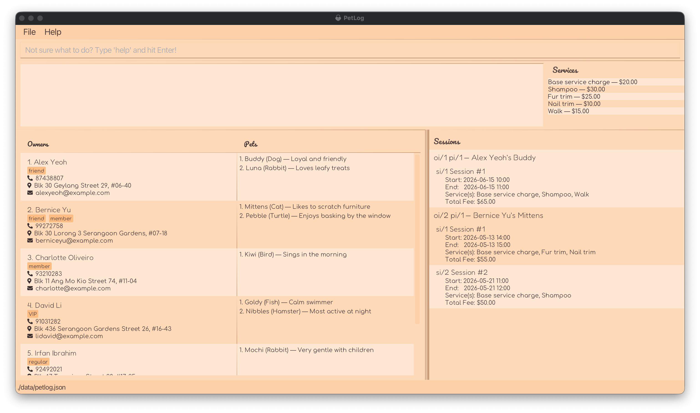
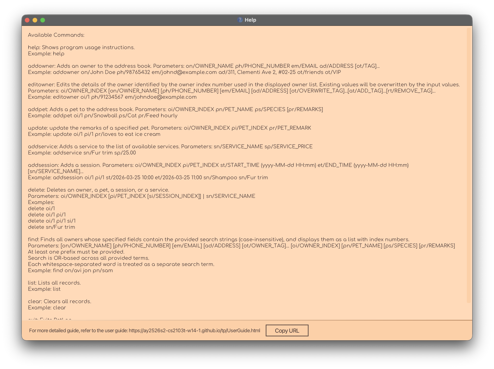

PetLog is a **desktop app for managing pet care operations**, optimised for use via a **Command Line Interface** (CLI)
while keeping the benefits of a **Graphical User Interface** (GUI).
With structured commands, it helps you manage, search and organize the details of owners and their pets efficiently. 
You can also add and keep track of the services you offer and also specific sessions where a pet will be receiving 
one of your services. 

* Table of Contents
{:toc}

--------------------------------------------------------------------------------------------------------------------

## Quick start

1. Ensure you have Java `17` or above installed on your computer. 
   **Mac users:** Ensure you have the precise JDK version prescribed [here](https://se-education.org/guides/tutorials/javaInstallationMac.html).

1. Download the latest `petlog.jar` file from the [releases page](https://github.com/AY2526S2-CS2103T-W14-1/tp/releases).

1. Copy the file to the folder you want to use as the _home folder_ for PetLog.

1. Open a command terminal, `cd` into the folder you put the jar file in, and run `java -jar petlog.jar`. 
   A GUI similar to the one below should appear in a few seconds. Note how the app contains some sample data. 
   

1. Type the command in the command box and press Enter to execute it. e.g. typing [`help`](#viewing-help-help) and pressing Enter will open the help window. 
   Some example commands you can try:

   * [`list`](#listing-all-owners-list) : Lists all owners and pets.

   * [`addowner on/John Doe ph/98765432 em/johnd@example.com ad/John street, block 123, #01-01`](#adding-an-owner-addowner) : Adds an owner.

   * [`addpet oi/1 pn/Molly ps/Golden Retriever pr/cuddly`](#adding-a-pet-under-an-owner-addpet) : Adds a pet.

   * [`addservice sn/Nail trim sp/10.00`](#adding-a-service-addservice) : Adds a new available service.

   * [`addsession oi/1 pi/1 st/2026-04-06 10:00 et/2026-04-06 11:00 sn/Nail trim`](#adding-a-session-addsession) : Adds a session for a pet.

   * [`clear`](#clearing-all-owners-pets-services-and-sessions-clear) : Clears all owners, pets, services, and sessions.

   * [`exit`](#exiting-the-program-exit) : Exits the app.

1. Refer to the [Features](#features) below for details of each command.

--------------------------------------------------------------------------------------------------------------------

## Features

**:information_source: Notes about the command format:** 

* Words in `UPPER_CASE` are the parameters to be supplied by the user. 
  e.g. in [`addowner on/OWNER_NAME`](#adding-an-owner-addowner), `OWNER_NAME` is a parameter which can be used as [`addowner on/John Doe`](#adding-an-owner-addowner).

* Items in square brackets are optional. 
  e.g. `on/OWNER_NAME [ot/TAG]` can be used as `on/John Doe ot/priority` or as `on/John Doe`.

* Items with `…​` after them can be used multiple times including zero times. 
  e.g. `[ot/TAG]…​` can be used as ` ` (i.e. 0 times), `ot/friend`, `ot/friend ot/family` etc.

* Parameters can be in any order. 
  e.g. if the command specifies `on/OWNER_NAME ph/PHONE_NUMBER`, `ph/PHONE_NUMBER on/OWNER_NAME` is also acceptable.

* Command words and prefixes are case-insensitive. 
  e.g. [`AdDoWnEr on/John Doe Ph/98765432 eM/j@example.com AD/123, Street`](#adding-an-owner-addowner) is accepted.

* Extraneous parameters for commands that do not take in parameters (such as [`help`](#viewing-help-help), [`list`](#listing-all-owners-list), [`exit`](#exiting-the-program-exit) and [`clear`](#clearing-all-owners-pets-services-and-sessions-clear)) will be ignored. 
  e.g. if the command specifies [`help 123`](#viewing-help-help), it will be interpreted as [`help`](#viewing-help-help).

* If you are using a PDF version of this document, be careful when copying and pasting commands that span multiple lines as space characters surrounding line-breaks may be omitted when copied over to the application.

### Viewing help: `help`

Shows a message explaining how to access the help page:

Format: `help`

### Adding an owner: `addowner`

Adds an owner to PetLog. An owner has a name, a phone number, an email, an address, and any number of tags.

Format: `addowner on/OWNER_NAME ph/PHONE_NUMBER em/EMAIL ad/ADDRESS [ot/TAG]…​`

* `OWNER_NAME` must be 1 to 50 characters.
* `PHONE_NUMBER` must be 2 to 30 characters.
* If `PHONE_NUMBER` contains any non-numeric characters, the command succeeds but shows a warning in case it was not intentional.
* `EMAIL` must be of the form `local-part@domain`.
* `ADDRESS` must be 1 to 100 characters.
* Each `TAG`, if provided, must be 1 to 20 characters.

Examples:
* `addowner on/John Doe ph/98765432 em/johnd@example.com ad/John street, block 123, #01-01`
* `addowner on/Betsy Crowe ot/friend em/betsycrowe@example.com ad/Newgate Prison ph/1234567 ot/criminal`

### Editing an owner: `editowner`

Edits an existing owner in PetLog.

Format: `editowner oi/OWNER_INDEX [on/OWNER_NAME] [ph/PHONE_NUMBER] [em/EMAIL] [ad/ADDRESS] [ot/OVERWRITE_TAG]…​ [at/ADD_TAG]…​ [rt/REMOVE_TAG]…​`

* `OWNER_INDEX` refers to the index number shown in the displayed owner list. It must be a positive integer.
* At least one of the optional fields must be provided, following the same input validation rules as in [`addowner`](#adding-an-owner-addowner).
* Existing values, except tags, will be updated to the input values.
* To add to existing tags, use `at/`.
* To remove existing tags, use `rt/`.
* To overwrite the existing tags, use `ot/`.
* You can remove all the owner's tags by typing `ot/` without specifying any tags after it.
* `ot/` cannot be used with `at/` or `rt/`.

Examples:
*  `editowner oi/1 ph/91234567 em/johndoe@example.com` edits the phone number and email address of the 1st owner to be `91234567` and `johndoe@example.com` respectively.
*  `editowner oi/3 rt/member at/VIP` removes the (assumed existing) `member` tag and adds a `VIP` tag to the 3rd owner.
*  `editowner oi/2 on/Betsy Crower ot/` edits the name of the 2nd owner to be `Betsy Crower` and clears all existing tags.

### Adding a pet under an owner: `addpet`

Adds a pet belonging to an existing owner in PetLog. A pet has an owner, a name, a species, and may have remarks.

Format: `addpet oi/OWNER_INDEX pn/PET_NAME ps/SPECIES [pr/REMARKS]`

* `OWNER_INDEX` refers to the index number shown in the displayed owner list. It must be a positive integer.
* `PET_NAME` must be 1 to 30 characters.
* `SPECIES` must be 1 to 30 characters.
* `REMARKS`, if provided, must be 1 to 100 characters.
* Attempting to add a duplicate pet, if both its name and species match an existing pet for the specified owner, will not succeed.

Examples:
* `addpet oi/2 pn/Molly ps/Golden Retriever pr/cuddly` adds a golden retriever called Molly under the 2nd owner in the list of owners; Molly will have a remark that she is cuddly.
* `addpet oi/1 pn/Dave ps/Great Dane` adds a great dane called Dave under the 1st owner on the list of owners.

### Updating the remarks of a pet: `update`

Format: `update oi/OWNER_INDEX pi/PET_INDEX pr/REMARKS`

Updates the remarks of a pet.

* `OWNER_INDEX` refers to the index number shown in the displayed owner list. It must be a positive integer.
* `PET_INDEX` refers to the index number shown in the displayed pet list of the specified owner. It must be a positive integer.
* Existing remarks will be overwritten and updated to the provided input.

Examples:
* `update oi/1 pi/3 pr/aggressive` updates the remark of the 3rd pet listed under the 1st owner to be "aggressive".

### Searching for owners: `find`

Finds owners whose details match at least one of the given keywords.

Format: `find [on/OWNER_NAME] [ph/PHONE_NUMBER] [em/EMAIL] [ad/ADDRESS] [ot/OWNER_TAG]…​ [oi/OWNER_INDEX] [pn/PET_NAME] [ps/SPECIES] [pr/REMARKS]`

* At least one of the optional fields must be provided.
* The search is case-insensitive. e.g `hans` will match `Hans`.
* Partial matches are displayed e.g. `Han` will match `Hans`.
* The order of the keywords does not matter. e.g. `Hans Bo` will match `Bo Hans`
* Owners matching at least one keyword will be returned (i.e. `OR` search) e.g. `Hans Bo` will match `Hans Gruber`, `Bo Yang`

Examples:
* `find ps/Dog` returns owners who own pets that are `Dog`s.
* `find on/avi jon` returns owners whose names contain `avi` OR `jon`, e.g. `Avi`, `Xavier`, `Jonathan`.
* `find ad/Tampines ot/VIP` returns owners whose address contains `Tampines` OR who are tagged as `VIP`s _(screenshot cropped to show relevant UI elements)_:
![[result for 'find ad/Tampines ot/VIP']](images/findAdTampinesOtVip.png)

### Listing all owners: `list`

Shows a list of all owners and pets in PetLog.

Format: `list`

:bulb: **Tip:**
Use `list` after using [`find`](#searching-for-owners-find) to go back to displaying all owners and pets.

### Adding a service: `addservice`

Adds a service to the service catalogue. A service has a name and a price.

Format: `addservice sn/SERVICE_NAME sp/SERVICE_PRICE`

* `SERVICE_NAME` must be 1 to 30 characters.
* `SERVICE_PRICE` is in dollars, and must be a number from `0` to `10000` (inclusive), with up to 2 decimal places.
* Attempting to add a duplicate service, if its name matches an existing service in the service catalogue, will not succeed.

Examples:
* `addservice sn/Ear Cleaning sp/12.50` adds Ear Cleaning as a service to the list with the price of $12.50.

### Adding a session: `addsession`

Adds a session for the specified pet. A session has a pet, a start time, an end time, and a list of services, from which the fee is calculated.

Format: `addsession oi/OWNER_INDEX pi/PET_INDEX st/START_TIME et/END_TIME [sn/SERVICE_NAME]…​`

* `OWNER_INDEX` refers to the index number shown in the displayed owner list. It must be a positive integer.
* `PET_INDEX` refers to the index number shown in the displayed pet list of the specified owner. It must be a positive integer.
* `START_TIME` and `END_TIME` must be of the format `yyyy-MM-dd HH:mm`.
* `END_TIME` must be chronologically after `START_TIME`.
* `SERVICE_NAME`, if provided, must match an existing service in the service catalogue.
* Attempting to add a session whose timing overlaps with an existing session for the specified pet will not succeed.

Examples:
* `addsession oi/1 pi/2 st/2026-05-15 14:30 et/2026-05-15 15:30 sn/Base service charge sn/Shampoo` adds a session for the 2nd pet listed under the 1st owner; it is from 2:30pm to 3:30pm on 15 May 2026; its list of services are `Base service charge` and `Shampoo`.

### Deleting an owner, pet, session or service: `delete`

`delete` has two usages with their own respective formats.

**1. Deleting an owner, pet or session**

Deletes the specified owner, pet or session from PetLog.

Format: `delete oi/OWNER_INDEX [pi/PET_INDEX [si/SESSION_INDEX]]`

* `OWNER_INDEX` refers to the index number shown in the displayed owner list. It must be a positive integer.
* `PET_INDEX` refers to the index number shown in the displayed pet list of the specified owner. It must be a positive integer.
* `SESSION_INDEX` index refers to the index number shown in the displayed session list of the specified pet. It must be a positive integer.
* Using `delete` with the `oi/` prefix only deletes the owner at `OWNER_INDEX`.
* Using `delete` with the `oi/` and `pi/` prefixes only deletes the pet at `PET_INDEX` of that owner.
* Using `delete` with the `oi/`, `pi/` and `si/` prefixes deletes the session at `SESSION_INDEX` of that pet.

Examples:
* `delete oi/4` deletes the 4th owner listed.
* `delete oi/4 pi/2` deletes the 2nd pet listed of the 4th owner.
* `delete oi/4 pi/2 si/3` deletes the 3rd session listed of the 2nd pet of the 4th owner.
* [`list`](#listing-all-owners-list) followed by `delete oi/2` deletes the 2nd owner listed.
* [`find on/Betsy`](#searching-for-owners-find) followed by `delete oi/1 pi/2` deletes the 2nd pet of the 1st owner in the results of the [`find`](#searching-for-owners-find) command.

**2. Deleting a service**

Deletes a service from the service catalogue.

Format: `delete sn/SERVICE_NAME`

* `SERVICE_NAME` must match an existing service in the service catalogue.

Examples:
* `delete sn/Ear Cleaning` deletes Ear Cleaning as a service from the list (if it exists).

**:information_source: Note about the `delete` formats:** 

Using a combination of both formats, e.g. `delete oi/1 sn/Ear cleaning`, is invalid and will not succeed.

### Clearing all owners, pets, services and sessions: `clear`

Deletes all owners, pets, services and sessions from PetLog.

Format: `clear`

:bulb: **Tip:**
Use `clear` to remove the sample data when you first run PetLog so you can start putting in your own!

### Exiting the program: `exit`

Exits PetLog.

Format: `exit`

### Saving the data

PetLog data is saved in the hard disk automatically after any command that changes the data, and upon exiting. There is no need to save manually.

### Editing the data file

PetLog data is saved automatically as a JSON file `[JAR file location]/data/petlog.json`. Advanced users are welcome to update data directly by editing that data file.

:exclamation: **Caution:**
If your changes to the data file make its format invalid, PetLog will discard all data and start with an empty data file at the next run. Hence, it is recommended to take a backup of the file before editing it. 
Furthermore, certain edits can cause PetLog to behave in unexpected ways (e.g., if a value entered is outside of the acceptable range). Therefore, edit the data file only if you are confident that you can update it correctly.

### Undo/Redo `[Coming Soon]`

_Details coming soon ..._

--------------------------------------------------------------------------------------------------------------------

## FAQ

**Q**: How do I transfer my PetLog data to another computer? 
**A**: Install PetLog on the other computer, and overwrite the empty data file it creates with the file that contains the data from your previous PetLog home folder.

**Q**: Why do indexes become invalid after I run [`find`](#searching-for-owners-find)? 
**A**: Indexes always refer to the current displayed list. After filtering, either use the new filtered indexes or run [`list`](#listing-all-owners-list) to reset the indexes, before deleting/updating.

**Q**: How do I clear a pet’s remark? 
**A**: Use an empty remark value: [`update oi/OWNER_INDEX pi/PET_INDEX pr/`](#updating-the-remarks-of-a-pet-update).

**Q**: Can I create a session without services? 
**A**: Yes. `sn/` is optional in [`addsession`](#adding-a-session-addsession). If no services are provided, the session fee is `0.00`.

**Q**: How is a session’s total fee calculated? 
**A**: It is the sum of all services provided in the [`addsession`](#adding-a-session-addsession) command, using the current service prices in PetLog.

**Q**: Why does [`addsession`](#adding-a-session-addsession) fail with “Unknown service”? 
**A**: At least one `sn/SERVICE_NAME` does not exist in your current service list. Add it first with [`addservice`](#adding-a-service-addservice), or correct the name.

**Q**: Where is my data stored, and how do I reset to sample data? 
**A**: Data is stored at `[JAR location]/data/petlog.json`. Back up that file to migrate data. To reset to sample data, delete `petlog.json` and restart the app.

--------------------------------------------------------------------------------------------------------------------

## Known issues

1. **When using multiple screens**, if you move the application to a secondary screen, and later switch to using only the primary screen, the GUI will open off-screen. The remedy is to delete the `preferences.json` file created by the application before running the application again.

1. **If you minimise the Help Window** and then run the [`help`](#viewing-help-help) command (or use the `Help` menu, or the keyboard shortcut `F1`) again, the original Help Window will remain minimised, and no new Help Window will appear. The remedy is to manually restore the minimised Help Window.

--------------------------------------------------------------------------------------------------------------------

## Command summary

Action | Format, Examples
--------|------------------
[**Help**](#viewing-help-help) | `help`
[**Add Owner**](#adding-an-owner-addowner) | `addowner on/OWNER_NAME ph/PHONE_NUMBER em/EMAIL ad/ADDRESS [ot/TAG]…​`   e.g., `addowner on/John Doe ph/98765432 em/johnd@example.com ad/John street, block 123, #01-01`
[**Edit Owner**](#editing-an-owner-editowner) | `editowner oi/OWNER_INDEX [on/OWNER_NAME] [ph/PHONE_NUMBER] [em/EMAIL] [ad/ADDRESS] [ot/OVERWRITE_TAG]…​ [at/ADD_TAG]…​ [rt/REMOVE_TAG]…​`  e.g., `editowner oi/1 ph/91234567 em/johndoe@example.com`
[**Add Pet**](#adding-a-pet-under-an-owner-addpet) | `addpet oi/OWNER_INDEX pn/PET_NAME ps/SPECIES [pr/REMARKS]`   e.g., `addpet oi/2 pn/Molly ps/Golden Retriever pr/cuddly`
[**Update Pet Remarks**](#updating-the-remarks-of-a-pet-update) | `update oi/OWNER_INDEX pi/PET_INDEX pr/REMARKS`   e.g., `update oi/1 pi/3 pr/aggressive`
[**Search for Owners**](#searching-for-owners-find) | `find [on/OWNER_NAME] [ph/PHONE_NUMBER] [em/EMAIL] [ad/ADDRESS] [ot/OWNER_TAG]…​ [oi/OWNER_INDEX] [pn/PET_NAME] [ps/SPECIES] [pr/REMARKS]`  e.g., `find on/Hans ps/Dog`
[**List All Owners and Pets**](#listing-all-owners-list) | `list`
[**Add Service**](#adding-a-service-addservice) | `addservice sn/SERVICE_NAME sp/SERVICE_PRICE`   e.g., `addservice sn/Ear Cleaning sp/12.50`
[**Add Session**](#adding-a-session-addsession) | `addsession oi/OWNER_INDEX pi/PET_INDEX st/START_TIME et/END_TIME [sn/SERVICE_NAME]…​`   e.g., `addsession oi/1 pi/2 st/2026-05-15 14:30 et/2026-05-15 15:30 sn/Base service charge sn/Shampoo`
[**Delete Owner, Pet or Session**](#deleting-an-owner-pet-session-or-service-delete) | `delete oi/OWNER_INDEX [pi/PET_INDEX [si/SESSION_INDEX]]`  e.g., `delete oi/4 pi/2`
[**Delete Service**](#deleting-an-owner-pet-session-or-service-delete) | `delete sn/SERVICE_NAME`   e.g., `delete sn/Ear Cleaning`
[**Clear All Entries**](#clearing-all-owners-pets-services-and-sessions-clear) | `clear`
[**Exit Application**](#exiting-the-program-exit) | `exit`
